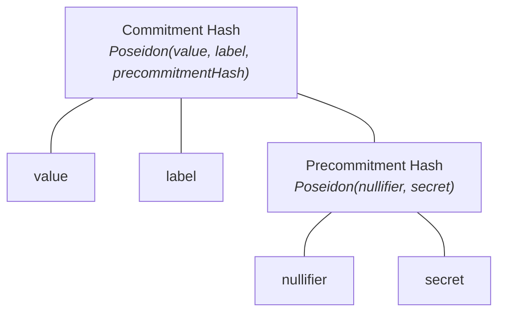

## Commitments and nullifiers

Each deposit into a Privacy Pool creates a commitment — a cryptographic record composed of:

- **`value`**: The amount being committed
- **`label`**: A unique identifier derived from the pool's scope and an incrementing nonce
- **`nullifier`**: A secret that prevents double-spending
- **`secret`**: A value that helps hide the nullifier

The protocol uses three hash constructions:

- **Commitment Hash**: `Poseidon(value, label, precommitmentHash)` — the on-chain leaf in the state Merkle tree
- **Precommitment Hash**: `Poseidon(nullifier, secret)` — submitted at deposit time. Because it hides the nullifier, the contract cannot link this precommitment to the nullifier hash that will later appear during withdrawal.
- **Nullifier Hash**: `Poseidon(nullifier)` — revealed on-chain during withdrawal or ragequit. The contract records it and rejects any future attempt to spend the same commitment (`NullifierAlreadySpent`). The nullifier itself stays private; only its hash is public, so observers cannot reconstruct the precommitment or link the withdrawal back to the original deposit.

Each pool has a **scope** — a unique identifier derived from the pool address, chain ID, and asset: `keccak256(pool, chainId, asset) % SNARK_SCALAR_FIELD`. Scope is used in API headers (`X-Pool-Scope`) and proof inputs to identify which pool an operation targets.

## Zero-knowledge proofs in Privacy Pools

Privacy Pools uses [zero-knowledge proofs](/layers/zk) to demonstrate valid statements about private information without revealing that information. The protocol employs three proof types:

- **[Commitment Proofs](/layers/zk/commitment)**: Verify the ownership of a commitment (used in ragequit)
- **[Withdrawal Proofs](/layers/zk/withdrawal)**: Verify ownership, inclusion in both state and ASP trees, and valid value transitions
- **[Merkle Proofs](/layers/zk/lean-imt)**: Demonstrate membership in a tree without revealing position

## State tree and ASP tree

The protocol maintains two separate Merkle trees per pool:

- **State tree**: Contains commitment hashes — one leaf per deposit and one per change commitment created during withdrawal. Managed on-chain by the pool contract. Root read via `pool.currentRoot()`.
- **ASP tree**: Contains approved labels. Managed off-chain by the ASP and periodically committed on-chain. Root read via `Entrypoint.latestRoot()` or the ASP API's `onchainMtRoot`.

Withdrawal proofs must demonstrate inclusion in **both** trees: the state tree (proving the commitment exists) and the ASP tree (proving the deposit was approved).

## Basic operations

- **[Deposit](/protocol/deposit)**
  - User generates commitment components
  - Deposits funds and submits commitment to pool
  - Commitment is added to the state tree
- **[Withdrawal](/protocol/withdrawal)**
  - User proves ownership of an existing commitment
  - Creates new commitment for remaining funds
  - Marks previous commitment as spent
  - Receives withdrawn assets
- **[Ragequit](/protocol/ragequit)**
  - Original depositor proves ownership of a commitment
  - Recovers full remaining deposit value
  - Marks commitment as spent

## Privacy model

Privacy Pools splits knowledge across participants so that no single party can link a deposit to its withdrawal.

| Party | Can see | Cannot see |
|---|---|---|
| **Depositor** | Their own secrets, label, deposit value | Other depositors' secrets |
| **Recipient** | Withdrawn amount arriving at their address | Which deposit funded it, depositor identity |
| **Relayer** | Proof validity, recipient address, fee amount | Deposit source, nullifier, commitment linkage |
| **ASP** | All deposit labels, which labels are approved | Nullifiers, secrets, withdrawal recipients |
| **On-chain observer** | Deposit amounts, withdrawal amounts, nullifier hashes | Link between any deposit and any withdrawal |

The withdrawal ZK proof demonstrates that the withdrawer owns a valid, ASP-approved commitment in the pool without revealing _which_ commitment. The relayer submits the transaction on behalf of the user, breaking the on-chain address link between depositor and recipient. The ASP sees deposit labels (which are public from deposit events) but never learns withdrawal destinations.

For the full deposit-to-withdrawal lifecycle, see [Using Privacy Pools](/protocol).
