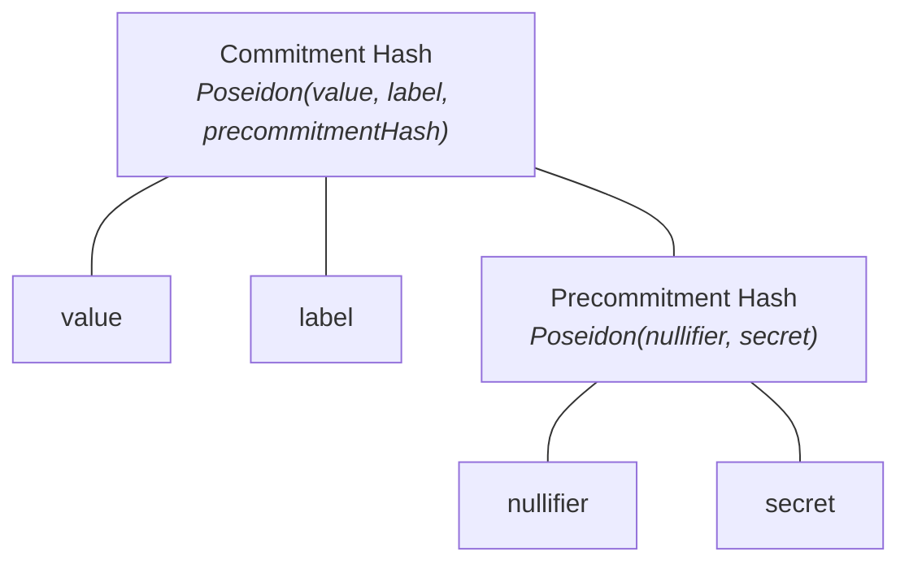

A user deposits into a pool, waits for ASP approval, then withdraws privately with a zero-knowledge proof. The proof shows they own a valid, approved deposit without revealing which one.

## Commitments

Each deposit creates a commitment: a cryptographic record composed of:

- **`value`**: The amount being committed
- **`label`**: A unique identifier derived from the pool's scope and an incrementing nonce. The ASP's approved set contains labels, and having your label approved is what unlocks the private withdrawal path
- **`nullifier`**: A secret that prevents double-spending
- **`secret`**: A value that helps hide the nullifier

The protocol uses three hash constructions:

- **Commitment Hash**: `Poseidon(value, label, precommitmentHash)`, the on-chain leaf in the state Merkle tree.
- **Precommitment Hash**: `Poseidon(nullifier, secret)`, submitted at deposit time. Hides the nullifier from the contract.
- **Nullifier Hash**: `Poseidon(nullifier)`, revealed on-chain during withdrawal or ragequit.
  - The contract records it and rejects any future attempt to spend the same commitment (`NullifierAlreadySpent`).
  - The nullifier itself stays private; only its hash is public.

Each pool has a **scope**, a unique `uint256` derived from the pool address, chain ID, and asset:

`keccak256(abi.encodePacked(poolAddress, chainId, asset)) % SNARK_SCALAR_FIELD`

The scope appears in API headers (`X-Pool-Scope`) and proof inputs. Read it on-chain via `pool.SCOPE()`.

## State tree and ASP tree

Each pool has two Merkle trees:

- **State tree**: Contains commitment hashes (one leaf per deposit and one per change commitment created during withdrawal). Managed on-chain by the pool contract. Root read via `pool.currentRoot()`.
- **ASP tree**: Contains approved labels. Managed off-chain by the ASP and periodically committed on-chain. Root read via `Entrypoint.latestRoot()` or the ASP API's `onchainMtRoot`.

Withdrawal proofs must show membership in **both** trees: the state tree (the commitment exists) and the ASP tree (the deposit was approved).

### ASP

An Association Set Provider (ASP) is an off-chain service that reviews deposits and maintains a Merkle tree of approved labels. It does not custody funds or block deposits. ASP approval unlocks the private withdrawal path; without it, the depositor can still [ragequit](/protocol/ragequit). The ASP never learns withdrawal destinations or nullifier secrets. See [ASP Layer](/layers/asp) for how it works on-chain.

### Relayer

A relayer submits withdrawal transactions on the user's behalf so the recipient address never appears as the on-chain sender.

## Proof types

The protocol uses two ZK proof types:

- **[Commitment proofs](/layers/zk/commitment)** prove ownership of a commitment. Used for [ragequit](/protocol/ragequit).
- **[Withdrawal proofs](/layers/zk/withdrawal)** prove ownership of an ASP-approved commitment and the correctness of the state transition. Merkle inclusion proofs for both trees are embedded inside the circuit.

## Basic operations

- **[Deposit](/protocol/deposit)**
  - User generates commitment components
  - Deposits funds and submits commitment to pool
  - Commitment is added to the state tree
- **[Withdrawal](/protocol/withdrawal)**
  - User proves ownership of an existing commitment
  - Creates new commitment for remaining funds
  - Marks previous commitment as spent
  - Receives withdrawn assets
- **[Ragequit](/protocol/ragequit)**
  - Original depositor proves ownership of a commitment
  - Recovers full remaining deposit value
  - Marks commitment as spent

## Privacy model

Each participant only sees part of the picture, so nobody can link a deposit to its withdrawal.

| Party | Can see | Cannot see |
|---|---|---|
| **Depositor** | Their own secrets, label, deposit value | Other depositors' secrets |
| **Recipient** | The withdrawal amount | Which deposit funded it, depositor identity |
| **Relayer** | Proof validity, recipient address, fee amount | Deposit source, nullifier, which deposit funded it |
| **ASP** | All deposit labels, which labels are approved | Nullifiers, secrets, withdrawal recipients |
| **On-chain observer** | Deposit amounts, withdrawal amounts, nullifier hashes | Link between any deposit and any withdrawal |

The ZK proof shows the withdrawer owns a valid, approved commitment without revealing which one. The relayer submits the transaction, so there is no on-chain link between the depositor and the recipient.

The ASP sees deposit labels (which are public from deposit events) but never learns withdrawal destinations.

See [Using Privacy Pools](/protocol) for the deposit-to-withdrawal lifecycle.

## Next steps

- [Using Privacy Pools](/protocol) for the end-to-end lifecycle
- [Start Here](/build/start) for the builder path
- [Protocol Components](/layers) for the contract and circuit architecture
