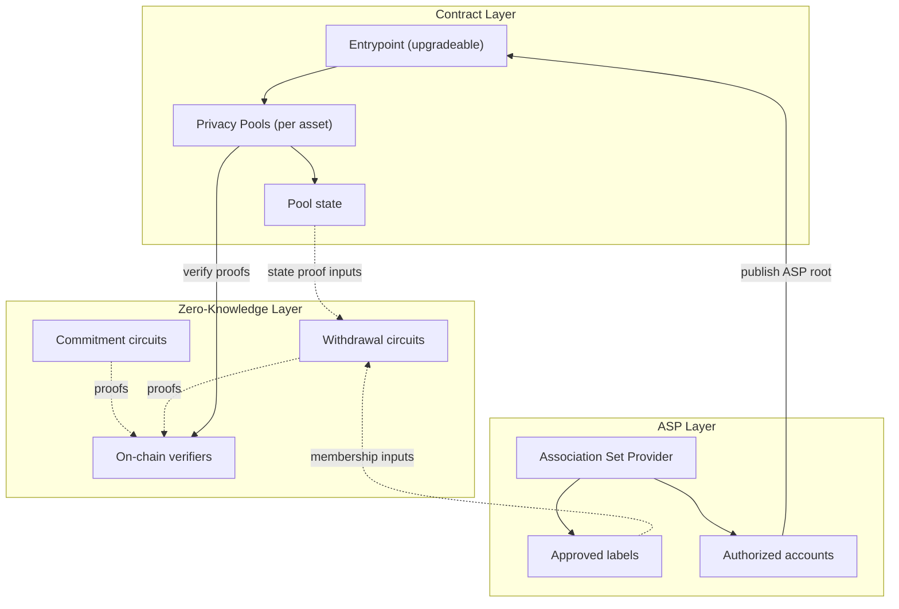

## The challenge of private transactions

On public blockchains like Ethereum, every transaction is visible to everyone. While this transparency is a core feature, it creates significant privacy challenges and risks for users. When all transactions are visible, every transaction reveals the full balances and transaction history of both parties.

## Privacy Pools offers a solution

Privacy Pools enables private withdrawals through a combination of zero-knowledge proofs and commitment schemes. Users can deposit assets into Privacy Pools and later withdraw them, either partially or fully, without creating an on-chain link between their deposit and withdrawal addresses. The protocol uses an [Association Set Provider (ASP)](/layers/asp) to maintain a set of approved deposits, preventing potentially illicit funds from entering the system and enabling regulatory compliance.

## System architecture overview

Privacy Pools' architecture consists of three distinct layers:

1. **[Contract Layer](/layers/contracts)**
   - An upgradeable [Entrypoint](/layers/contracts/entrypoint) contract that coordinates ASP-operated privacy pools
   - Asset-specific [Privacy Pools](/layers/contracts/privacy-pools) that hold funds and manage state
2. **[Zero-Knowledge Layer](/layers/zk)**
   - [Commitment circuits](/layers/zk/commitment) for secure deposit registration
   - [Withdrawal circuits](/layers/zk/withdrawal) that enable private asset withdrawals
   - On-chain verifiers that validate circuit proofs
3. **[Association Set Provider (ASP) Layer](/layers/asp)**
   - Maintains the current set of approved deposit labels
   - Updates state through authorized accounts
   - Enables regulatory compliance without compromising privacy

These layers work together to create a secure privacy-preserving system: the contract layer manages assets and state, the zero-knowledge layer ensures privacy, and the ASP layer provides compliance capabilities.

Privacy Pools also supports relayed withdrawals via Entrypoint. Recommended frontends use the relayed path for recipient privacy from the transaction sender, while direct pool withdrawals remain an advanced non-private option. For details, see [Withdrawal](/protocol/withdrawal). To start integrating, see [Integrations](/protocol/integrations).

## Key features and capabilities

- **Partial Withdrawals**: Users can withdraw portions of their deposits while maintaining privacy.
- **Multi-Asset Support**: Supports both native cryptocurrency and ERC20 tokens.
- **Compliance Integration**: ASP-based approval system for regulatory compliance.
- **Non-Custodial**: Users maintain control of their funds through cryptographic commitments.
- **[Ragequit](/protocol/ragequit) Mechanism**: Allows original depositors to recover funds if their funds are not approved by the ASP by **publicly** exiting the privacy pool.
