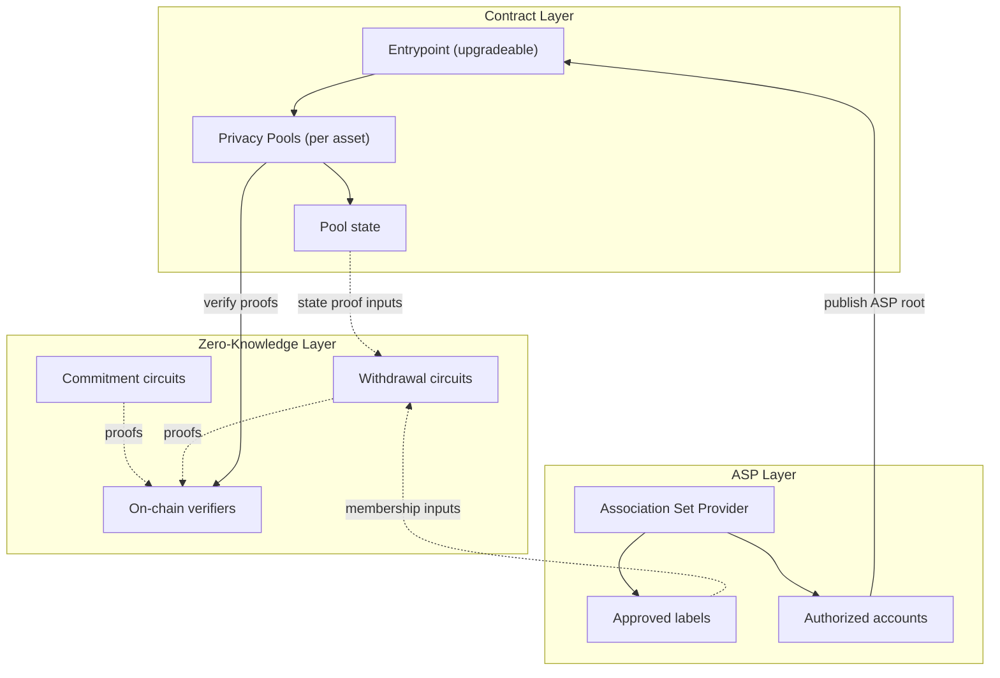

**Privacy Pools is a protocol for private withdrawals on Ethereum.** Users deposit assets publicly, then withdraw privately with zero-knowledge proofs once their deposit has been approved by an Association Set Provider (ASP). A relayer submits the withdrawal transaction on their behalf, so there is no on-chain link between deposit and withdrawal addresses.

Deposits are never blocked at entry, and anyone can deposit at any time. An [Association Set Provider (ASP)](/layers/asp) independently evaluates deposits after they enter the pool and maintains a set of approved labels. ASP approval is what unlocks the private withdrawal path.

If a deposit is not approved (or the user prefers not to wait), the original depositor can always [ragequit](/protocol/ragequit), a public exit that returns the full balance without ASP approval.

## Start here

| Goal | Page |
|---|---|
| Understand the protocol lifecycle | [Using Privacy Pools](/protocol) |
| Build a frontend integration | [Build](/build) |
| Use AI coding agents to build | [Agent Setup](/build/agents) |
| Look up chain addresses and `startBlock` | [Deployments](/deployments) |

## System architecture overview

Privacy Pools' architecture consists of three distinct layers:

1. **[Contract Layer](/layers/contracts)**
   - An upgradeable [Entrypoint](/layers/contracts/entrypoint) contract that coordinates ASP-operated privacy pools
   - Asset-specific [Privacy Pools](/layers/contracts/privacy-pools) that hold funds and manage state
2. **[Zero-Knowledge Layer](/layers/zk)**
   - [Commitment circuits](/layers/zk/commitment) for secure deposit registration
   - [Withdrawal circuits](/layers/zk/withdrawal) that enable private asset withdrawals
   - On-chain verifiers that validate circuit proofs
3. **[Association Set Provider (ASP) Layer](/layers/asp)**
   - Maintains the current set of approved deposit labels
   - Updates state through authorized accounts

## Key features

- **Deposits are never blocked**: Anyone can deposit at any time. The ASP evaluates deposits after entry, not before.
- **Privacy via relayed withdrawals**: A relayer submits the withdrawal transaction, so the recipient address has no on-chain link to the depositor.
- **Partial Withdrawals**: Users can withdraw portions of their deposits while maintaining privacy.
- **[Ragequit](/protocol/ragequit) is always available**: Original depositors can publicly reclaim their funds at any time, even if the ASP has not approved the deposit.
- **Compliance without custody**: The ASP handles compliance, but users keep full control of their funds.
