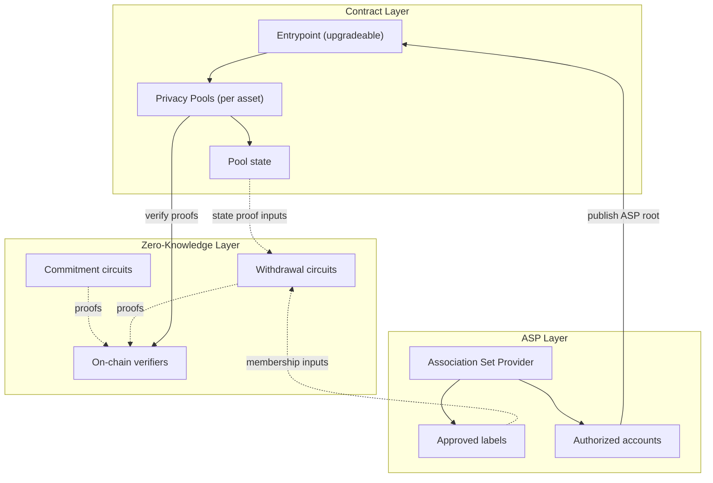

## The challenge of private transactions

On public blockchains like Ethereum, every transaction is visible to everyone. While this transparency is a core feature, it creates significant privacy challenges for users: every transaction reveals the full balances and transaction history of both parties.

## How Privacy Pools works

Privacy Pools enables private withdrawals through a combination of zero-knowledge proofs and commitment schemes. Users can deposit assets into Privacy Pools and later withdraw them, either partially or fully, without creating an on-chain link between their deposit and withdrawal addresses.

The protocol uses an [Association Set Provider (ASP)](/layers/asp) to maintain a set of approved deposits, excluding potentially illicit deposits from the private withdrawal path and enabling regulatory compliance.

A relayer submits the withdrawal transaction on the user's behalf, so there is no on-chain link between the deposit address and the withdrawal recipient. If private withdrawal is unavailable, the original depositor can always [ragequit](/protocol/ragequit) to reclaim funds publicly.

## System architecture overview

Privacy Pools has three layers:

1. **[Contract Layer](/layers/contracts)**
   - An upgradeable [Entrypoint](/layers/contracts/entrypoint) contract that coordinates pool routing and relay execution
   - Asset-specific [Privacy Pools](/layers/contracts/privacy-pools) that hold funds and manage state
2. **[Zero-Knowledge Layer](/layers/zk)**
   - [Commitment circuits](/layers/zk/commitment) for secure deposit registration
   - [Withdrawal circuits](/layers/zk/withdrawal) for private exits
   - On-chain verifiers that validate circuit proofs
3. **[Association Set Provider (ASP) Layer](/layers/asp)**
   - Maintains the current set of approved deposit labels
   - Updates state through authorized accounts
   - Enables regulatory compliance while preserving withdrawal privacy

## Key features and capabilities

- **Partial withdrawals**: Users can withdraw portions of their deposits while maintaining privacy.
- **Multi-asset support**: Supports both native cryptocurrency and ERC20 tokens.
- **Compliance integration**: ASP-based approval system for regulatory compliance.
- **Non-custodial**: Users maintain control of their funds through cryptographic commitments.
- **[Ragequit](/protocol/ragequit)**: Allows original depositors to recover funds by publicly exiting the privacy pool, even without ASP approval.

These layers work together to create a secure privacy-preserving system: the contract layer manages assets and state, the zero-knowledge layer ensures privacy, and the ASP layer provides compliance capabilities.

Read [Using Privacy Pools](/protocol) for the full lifecycle, or jump to [Build](/build) to start integrating.
