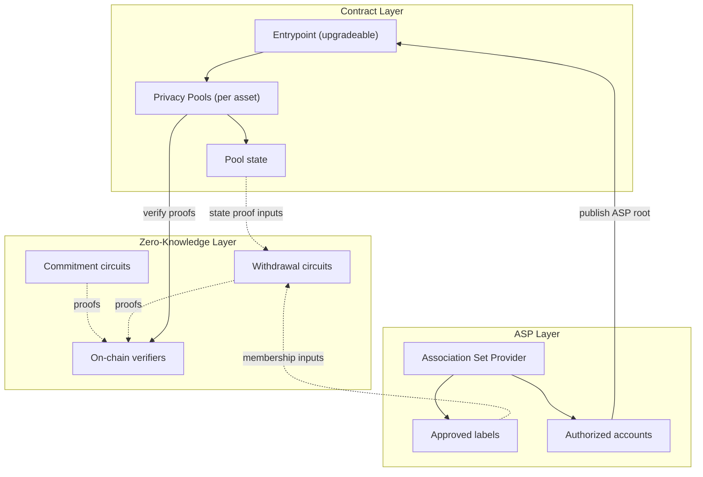

## The challenge of private transactions

On public blockchains, every transaction is visible. That transparency is useful, but it also means balances, counterparties, and transaction history can be pieced together by anyone watching the chain.

Privacy Pools makes withdrawals private without sacrificing deposit transparency or protocol-level compliance. Deposits still happen in public. What changes is the exit path: users can withdraw to a fresh address without creating an on-chain link back to the deposit address.

## How Privacy Pools responds

Privacy Pools lets users deposit assets into a shared pool, then later withdraw them privately with a zero-knowledge proof. That proof shows the user controls a valid deposit and is allowed to spend it, without revealing which deposit is being spent.

An [Association Set Provider (ASP)](/layers/asp) reviews deposits after they enter the pool and maintains the set of approved labels. ASP approval unlocks the private withdrawal path, but it does not block deposits and it does not custody user funds.

A relayer submits the withdrawal transaction on the user's behalf, so there is no on-chain link between the deposit address and the withdrawal recipient. If private withdrawal is unavailable, the original depositor can always [ragequit](/protocol/ragequit) to reclaim funds publicly.

## System architecture overview

Privacy Pools has three layers:

1. **[Contract Layer](/layers/contracts)**
   - An upgradeable [Entrypoint](/layers/contracts/entrypoint) contract that coordinates pool routing and relay execution
   - Asset-specific [Privacy Pools](/layers/contracts/privacy-pools) that hold funds and manage state
2. **[Zero-Knowledge Layer](/layers/zk)**
   - [Commitment circuits](/layers/zk/commitment) for secure deposit registration
   - [Withdrawal circuits](/layers/zk/withdrawal) for private exits
   - On-chain verifiers that validate circuit proofs
3. **[Association Set Provider (ASP) Layer](/layers/asp)**
   - Maintains the current set of approved deposit labels
   - Updates state through authorized accounts
   - Required for private withdrawals, but never takes custody of user funds

## Key features

- **Deposits are never blocked**: Anyone can deposit at any time. The ASP evaluates deposits after entry, not before.
- **Privacy via relayed withdrawals**: A relayer submits the withdrawal transaction, so the recipient address has no on-chain link to the depositor.
- **Partial withdrawals**: Users can withdraw part of a deposit and keep the remaining balance in the pool.
- **[Ragequit](/protocol/ragequit)**: The original depositor can always exit publicly back to the deposit address, even without ASP approval.
- **Compliance without custody**: The ASP reviews deposits, but users keep full control of their funds.

If you want the full lifecycle in one place, read [Using Privacy Pools](/protocol). If you are integrating the protocol into an app, start with [Build](/build).
