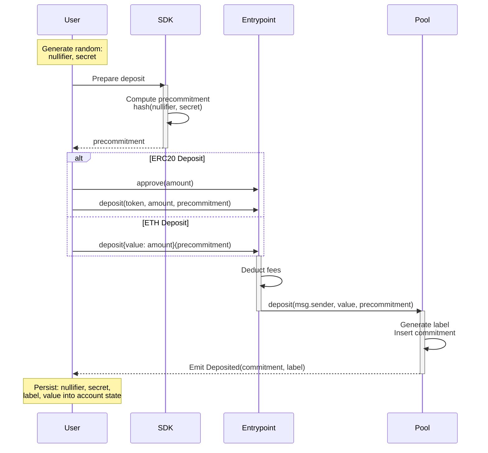
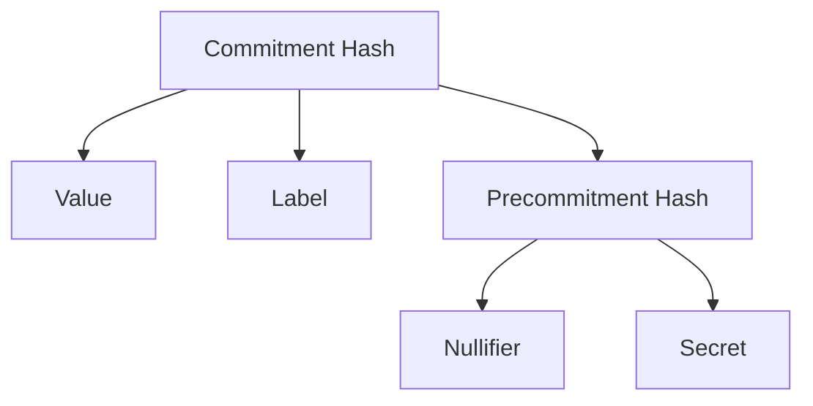

The deposit operation is the entry point into the Privacy Pools protocol. It allows users to publicly deposit assets (ETH or ERC20 tokens) into a pool, creating a private commitment that can later be used for [private withdrawals](/protocol/withdrawal) or public [ragequit](/protocol/ragequit) operations.

:::info Integration
For production workflow guidance, see [Integrations](/protocol/integrations) and [skills.md](https://docs.privacypools.com/skills.md).
:::

Production frontend integrations should capture the `Deposited` event into mnemonic/account-backed pool-account state. Pool-account UX keeps raw secrets out of manual note copy/paste flows and other UI surfaces where they can be exposed, including XSS or clipboard risks.

## Production Frontend Pattern

- Bootstrap or load the mnemonic-backed account before deposit so the new pool account can be persisted immediately.
- Derive deposit secrets from account state plus pool scope and sequential deposit index.
- If you expose `Use max`, reserve gas for native-asset deposits and account for vetting-fee math before setting the final input amount.
- If the wallet supports batching, approval + deposit can be presented as one action. The same pattern can extend to stake-then-deposit flows as long as the final deposited asset and expected amount are explicit in the review UI.
- Parse the confirmed `Deposited` event into local pool-account state right away.
- Tell users that chain confirmation does not guarantee immediate indexing or ASP review visibility.

## Protocol Flow

### Commitment Structure

The deposit process creates a commitment with the following structure:

### Parameters

| Parameter       | Description                                                                     |
| --------------- | ------------------------------------------------------------------------------- |
| `value`         | The deposit amount after fees                                                   |
| `label`         | `keccak256(scope, nonce)` where scope is pool-specific and nonce is incremental |
| `nullifier`     | Random value used to create unique commitments                                  |
| `secret`        | Random value that helps secure the commitment                                   |
| `precommitment` | Hash(nullifier, secret)                                                         |

### Deposit Steps

1. **Input Preparation**

- User generates random `nullifier` and `secret` values
- User computes `precommitment = hash(nullifier, secret)`

2. **Deposit Transaction**

- User calls Entrypoint's deposit function with asset, amount, and precommitment
- For ETH: `deposit(precommitment)` with ETH value
- For ERC20: `deposit(token, amount, precommitment)` after approval

3. **Fee Processing**

- Entrypoint calculates and retains vetting fee (configurable per pool)
- Remaining amount is forwarded to pool

4. **Commitment Generation**

- Pool generates unique `label` using scope and incremental nonce
- Computes commitment hash using value, label, and precommitment
- Inserts commitment into state Merkle tree

### Fee Structure

- Vetting fee: Configurable percentage (in basis points) taken by Entrypoint
- Example: 100 basis points = 1% fee
