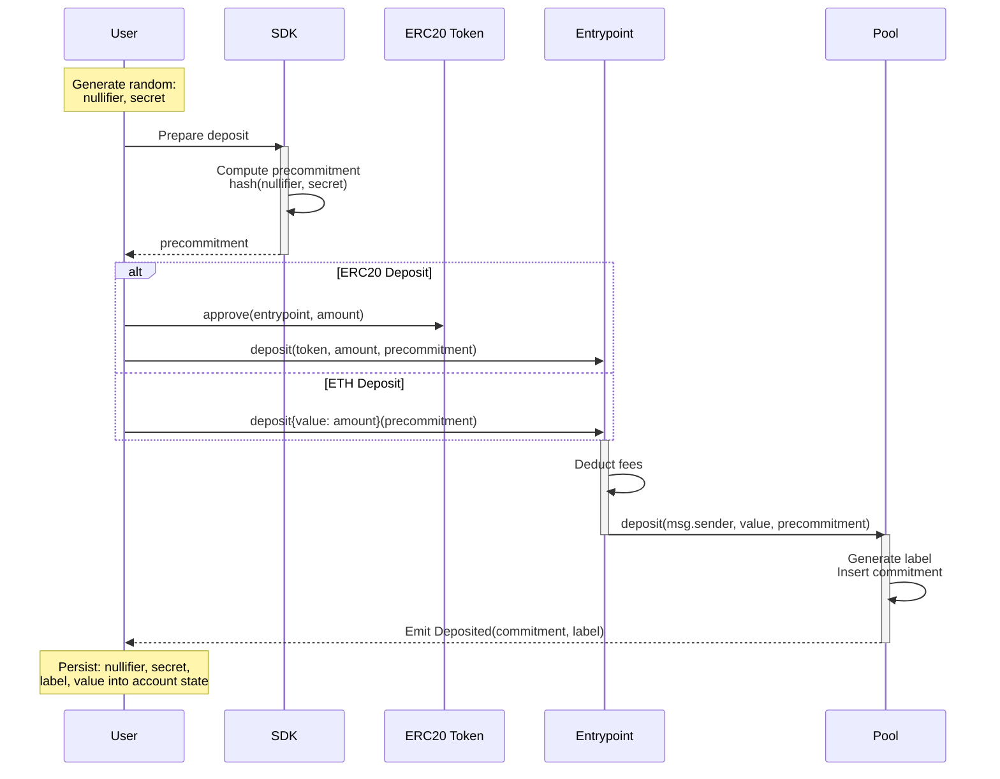
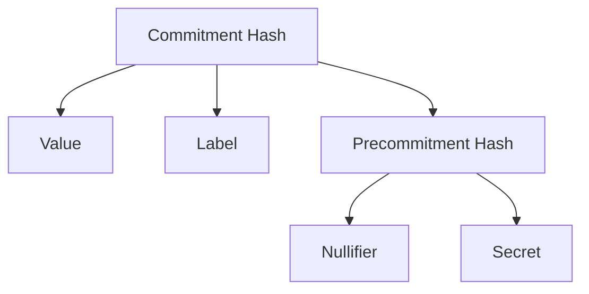

The deposit operation is the entry point into the Privacy Pools protocol. It allows users to publicly deposit assets (ETH or ERC20 tokens) into a pool, creating a private commitment that can later be used for [private withdrawals](/protocol/withdrawal) or public [ragequit](/protocol/ragequit) operations.

## Protocol Flow



### Commitment Structure

The deposit process creates a commitment with the following structure:



### Parameters

| Parameter       | Description                                                                     |
| --------------- | ------------------------------------------------------------------------------- |
| `value`         | The deposit amount after fees                                                   |
| `label`         | Generated on-chain by the pool contract; read from the `Deposited` event |
| `nullifier`     | Random value used to create unique commitments                                  |
| `secret`        | Random value that helps secure the commitment                                   |
| `precommitment` | Hash(nullifier, secret)                                                         |

### Deposit Steps

1. **Input Preparation**

- User generates random `nullifier` and `secret` values
- User computes `precommitment = hash(nullifier, secret)`

2. **Deposit Transaction**

- User calls Entrypoint's deposit function with asset, amount, and precommitment
- For ETH: `deposit(precommitment)` with ETH value
- For ERC20: `deposit(token, amount, precommitment)` after approval

3. **Fee Processing**

- Entrypoint calculates and retains vetting fee (configurable per pool)
- Remaining amount is forwarded to pool

4. **Commitment Generation**

- Pool generates unique `label` using scope and incremental nonce
- Computes commitment hash using value, label, and precommitment
- Inserts commitment into state Merkle tree

### Fee Structure

- Vetting fee: Configurable percentage (`vettingFeeBPS`) taken by the Entrypoint on every deposit
- Example: 100 basis points = 1% fee
:::warning Fee is deducted on deposit
The fee is deducted **on deposit**, not on withdrawal. The `value` emitted in the `Deposited` event is the post-fee `committedValue`, which may be less than the `amount` sent. Always use this post-fee value when reconstructing commitments or computing withdrawal amounts.
:::

### Minimum Deposit

Each asset has a `minimumDepositAmount` configured on the Entrypoint. The contract enforces this and reverts with `MinimumDepositAmount` if the deposit is below the threshold. Check this before submitting:

```typescript
const config = await publicClient.readContract({
  address: entrypointAddress,
  abi: [{
    name: "assetConfig",
    type: "function",
    inputs: [{ name: "_asset", type: "address" }],
    outputs: [
      { name: "_pool", type: "address" },
      { name: "_minimumDepositAmount", type: "uint256" },
      { name: "_vettingFeeBPS", type: "uint256" },
      { name: "_maxRelayFeeBPS", type: "uint256" },
    ],
    stateMutability: "view",
  }],
  functionName: "assetConfig",
  args: [assetAddress],
});
if (amount < config[1]) {
  throw new Error("Deposit below minimum");
}
```

### What to Persist After Deposit

After a successful deposit, parse the `Deposited` event and persist the following into pool-account state:

| Value | Source | Purpose |
|-------|--------|---------|
| `label` | `Deposited` event `_label` field | Identifies the deposit in the ASP tree; needed for withdrawal proofs and ragequit |
| `committedValue` | `Deposited` event `_value` field (post-fee) | The actual committed amount; used to compute valid withdrawal amounts |
| `nullifier` | Locally generated | Required to reconstruct the commitment and generate proofs |
| `secret` | Locally generated | Required to reconstruct the commitment and generate proofs |

Store these in mnemonic-backed account state rather than surfacing raw deposit secrets to the user.

:::warning
Do not expose raw deposit secrets (nullifier, secret) in copy/paste or clipboard flows.
:::

### Account and Recovery

Frontends should use mnemonic-backed pool accounts. Deposit secrets (`nullifier`, `secret`) are derived deterministically from the mnemonic, pool scope, and a sequential deposit index, so accounts can be fully reconstructed from the mnemonic and on-chain events.

- If offering wallet-signature onboarding, gate it by wallet capability: sign the same EIP-712 payload twice and compare.
  - If signatures differ, use manual mnemonic setup.
- Require the user to save the recovery phrase before the first deposit.
- For manual recovery phrase entry, sanitize whitespace, newlines, and commas, and validate the checksum before use.

### Precommitment Uniqueness

Each precommitment hash can only be used once across all pools. The Entrypoint tracks used precommitments and reverts with `PrecommitmentAlreadyUsed` on duplicates.

If a deposit transaction reverts or is never mined, the precommitment is not consumed — retry with the same index. Only increment the index after a confirmed successful deposit.
