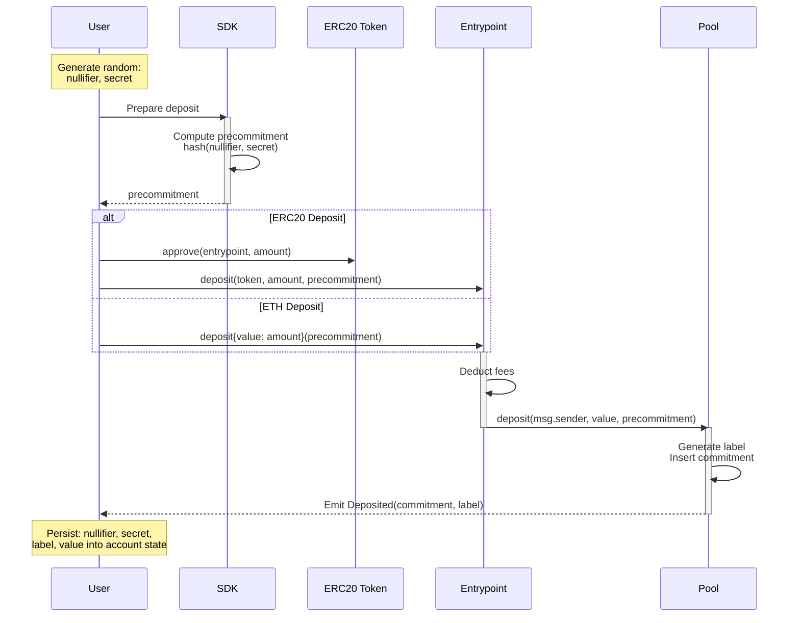

Users deposit ETH or ERC-20 tokens into a pool through the Entrypoint, creating a commitment that can later be spent via private withdrawal or ragequit.

## Protocol Flow


```mermaid
sequenceDiagram
    participant User
    participant SDK
    participant Token as ERC20 Token
    participant Entrypoint
    participant Pool


    Note over User: Generate random:<br/>nullifier, secret
    User->>SDK: Prepare deposit

    activate SDK
    SDK->>SDK: Compute precommitment<br/>hash(nullifier, secret)
    SDK-->>User: precommitment
    deactivate SDK

    alt ERC20 Deposit
        User->>Token: approve(entrypoint, amount)
        User->>Entrypoint: deposit(token, amount, precommitment)
    else ETH Deposit
        User->>Entrypoint: deposit{value: amount}(precommitment)
    end

    activate Entrypoint
    Entrypoint->>Entrypoint: Deduct fees
    Entrypoint->>Pool: deposit(msg.sender, value, precommitment)
    deactivate Entrypoint

    activate Pool
    Pool->>Pool: Generate label<br/>Insert commitment
    Pool-->>User: Emit Deposited(commitment, label)
    deactivate Pool

    Note over User: Persist: nullifier, secret,<br/>label, value into account state
```

For the commitment hash structure, see [Core Concepts: Commitments](/overview/core-concepts#commitments).

### Parameters

| Parameter       | Description                                                                     |
| --------------- | ------------------------------------------------------------------------------- |
| `value`         | The deposit amount after fees                                                   |
| `label`         | Generated on-chain by the pool contract; read from the `Deposited` event |
| `nullifier`     | Random value whose hash is revealed at spend time to prevent double-spending                                  |
| `secret`        | Random value that hides the nullifier inside the precommitment hash                                   |
| `precommitment` | Hash(nullifier, secret)                                                         |

### Deposit Steps

1. Generate `nullifier` and `secret`, compute `precommitment = Poseidon(nullifier, secret)`.
2. Submit the deposit transaction: `deposit(precommitment)` for ETH or `deposit(token, amount, precommitment)` for ERC-20 (after approval).
3. The Entrypoint deducts the vetting fee and forwards the remaining amount to the pool.
4. The pool generates a `label`, computes the commitment hash, and inserts it into the state Merkle tree.

:::warning Fee is deducted on deposit
The fee is deducted **on deposit**, not on withdrawal. The `value` emitted in the `Deposited` event is the post-fee `committedValue`, which may be less than the `amount` sent. Always use this post-fee value when reconstructing commitments or computing withdrawal amounts.
:::

### Minimum Deposit

Each asset has a `minimumDepositAmount` configured on the [Entrypoint](/deployments). The contract enforces this and reverts with `MinimumDepositAmount` if the deposit is below the threshold. Check this before submitting:

```typescript
// entrypointAddress: get from /deployments for your target chain
const config = await publicClient.readContract({
  address: entrypointAddress,
  abi: [{
    name: "assetConfig",
    type: "function",
    inputs: [{ name: "_asset", type: "address" }],
    outputs: [
      { name: "_pool", type: "address" },
      { name: "_minimumDepositAmount", type: "uint256" },
      { name: "_vettingFeeBPS", type: "uint256" },
      { name: "_maxRelayFeeBPS", type: "uint256" },
    ],
    stateMutability: "view",
  }],
  functionName: "assetConfig",
  args: [assetAddress],
});
const [, minimumDepositAmount] = config;
if (amount < minimumDepositAmount) {
  throw new Error("Deposit below minimum");
}
```

### What to Persist After Deposit

After a successful deposit, parse the `Deposited` event and save these values to the pool account:

| Value | Source | Purpose |
|-------|--------|---------|
| `label` | `Deposited` event `_label` field | Identifies the deposit in the ASP tree; needed for withdrawal proofs and ragequit |
| `committedValue` | `Deposited` event `_value` field (post-fee) | The actual committed amount; used to compute valid withdrawal amounts |
| `nullifier` | Locally generated | Required to reconstruct the commitment and generate proofs |
| `secret` | Locally generated | Required to reconstruct the commitment and generate proofs |

:::warning
Do not expose raw deposit secrets (nullifier, secret) in copy/paste or clipboard flows.
:::

### Account and Recovery

Frontends should use mnemonic-backed pool accounts. See [UX Patterns: Account and Recovery](/build/ux-patterns#account-and-recovery) for onboarding guidance and the [Integration Guide](/build/integration) for setup details.

### Precommitment Uniqueness

Each precommitment hash can only be used once across all pools. The Entrypoint tracks used precommitments and reverts with `PrecommitmentAlreadyUsed` on duplicates.

If a deposit transaction reverts or is never mined, the precommitment is not consumed and you can retry with the same deposit index. Only increment the index after a confirmed deposit.
