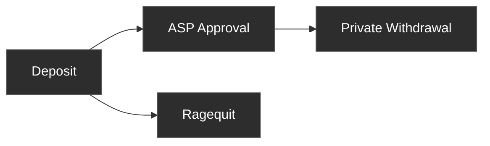

Privacy Pools has three operations. Users deposit assets into a pool. Once approved by the ASP, they can withdraw privately through a relayer. At any time, the original depositor can ragequit to publicly reclaim funds.

## [Deposit](/protocol/deposit)

A user commits assets into a Privacy Pool. The contract records a commitment in the pool's Merkle tree and deducts a vetting fee. The user must save their recovery phrase before depositing — it derives every secret needed to spend funds later.

After deposit, the ASP evaluates the deposit and decides whether to add its label to the approved set.

## Waiting for Approval

The ASP reviews deposits asynchronously. Most deposits are approved within an hour, though some may take longer. Show deposits as "pending" until the deposit's label appears in the ASP's approved set and the ASP tree root has converged on-chain.

For the technical convergence check and API endpoints, see the [Withdrawal page](/protocol/withdrawal#state-root-vs-asp-root) and the [ASP API Reference](/reference/asp-api).

## [Private Withdrawal](/protocol/withdrawal)

Once approved, the user can withdraw privately through a relayer. A zero-knowledge proof demonstrates ownership and ASP membership without revealing which deposit is being spent. The relayer submits the transaction so the withdrawal address has no on-chain link to the depositor.

Partial withdrawals are supported. Each withdrawal creates a change commitment with the remaining balance, which can be spent in a future withdrawal. Change commitments do not need fresh ASP approval — the withdrawal proof already demonstrated membership. Change commitments can be ragequit by the original depositor, since they share the same label and the depositor mapping persists.

## [Ragequit](/protocol/ragequit)

A public exit that returns the full balance to the original depositor address. Ragequit does not require ASP approval and can be called at any time, but it creates an on-chain link between the deposit and the exit. Only the original depositor can ragequit.

## Choosing Between Withdrawal and Ragequit

| | Private Withdrawal | Ragequit |
|---|---|---|
| **Privacy** | No on-chain link between depositor and recipient | Public link to depositor |
| **ASP approval** | Required | Not required |
| **Who can call** | Anyone with the recovery phrase | Only the original depositor address |
| **Partial amounts** | Yes, creates a change commitment | No, full balance only |

**The recovery phrase and the deposit wallet control different things.** The recovery phrase derives the secrets needed for private withdrawal — it can be used from any address. Ragequit can only be called from the wallet that made the original deposit. Neither is a universal fallback: losing the recovery phrase blocks private withdrawal, and losing access to the deposit wallet blocks ragequit.
