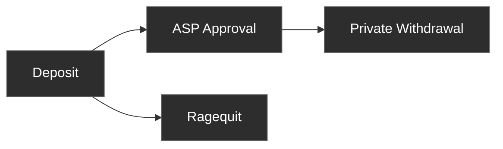

Privacy Pools has three operations. Users deposit assets into a pool. Once approved by the ASP, they can withdraw privately through a relayer. At any time, the original depositor can ragequit to publicly reclaim funds.

## [Deposit](/protocol/deposit)

A user commits assets into a Privacy Pool. The contract records a commitment leaf in the pool's Merkle tree and deducts a vetting fee. After deposit, the ASP evaluates the deposit and may add its label to the approved set.

## [Private Withdrawal](/protocol/withdrawal)

Once a deposit's label is ASP-approved, the user can withdraw privately through a relayer. A zero-knowledge proof demonstrates ownership and ASP membership without revealing which deposit is being spent. The relayer submits the transaction so the withdrawal address has no on-chain link to the depositor.

## [Ragequit](/protocol/ragequit)

A public exit that returns the full balance to the original depositor address. Ragequit does not require ASP approval and can be called at any time, but it creates an on-chain link between the deposit and the exit.
