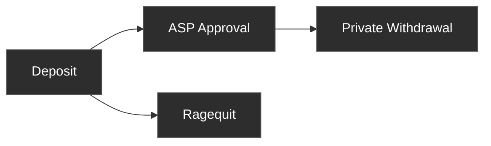

This page covers the full Privacy Pools lifecycle. If you are integrating the protocol for the first time, read [Start Here](/build/start) first, then use this page to shape the user journey and state model.

Users deposit assets into a pool. Once approved by the ASP, they can withdraw privately through a relayer. That sequence is the intended flow. At any time, the original depositor can ragequit to publicly reclaim funds back to the deposit address.

## [Deposit](/protocol/deposit)

A user commits assets into a Privacy Pool. The contract records a commitment in the pool's Merkle tree and deducts a vetting fee. The user must save their recovery phrase before depositing, since it derives every secret needed to spend funds later.

After deposit, the ASP evaluates the deposit and decides whether to add its label to the approved set.

## Waiting for ASP approval

The ASP reviews deposits asynchronously after they enter the pool. Show deposits as "pending" until the label appears in the ASP's approved set and the on-chain ASP root matches. Private withdrawal is blocked until then.

For the technical convergence check and API endpoints, see the [Withdrawal page](/protocol/withdrawal#state-root-vs-asp-root) and the [ASP API Reference](/reference/asp-api).

## [Private Withdrawal](/protocol/withdrawal)

Once approved, the user can withdraw privately through a relayer. A zero-knowledge proof demonstrates ownership and ASP membership without revealing which deposit is being spent. The relayer submits the transaction so the withdrawal address has no on-chain link to the depositor.

Partial withdrawals are supported. Each withdrawal creates a change commitment with the remaining balance, which can be spent in a future withdrawal. Change commitments inherit ASP approval from the withdrawal proof and can be ragequit by the original depositor (same label, same depositor mapping).

## [Ragequit](/protocol/ragequit)

A public exit that returns the full balance to the original depositor address. Ragequit ensures fund recovery even when a deposit cannot be privately withdrawn. It does not require ASP approval and can be called at any time, but it creates an on-chain link between the deposit and the exit. Only the original depositor can ragequit.

## Choosing Between Withdrawal and Ragequit

| | Private Withdrawal | Ragequit |
|---|---|---|
| **Privacy** | No on-chain link between depositor and recipient | Public link to depositor |
| **ASP approval** | Required | Not required |
| **Who can call** | Anyone with the recovery phrase (a BIP-39 mnemonic that derives all deposit secrets) | Only the original depositor address |
| **Partial amounts** | Yes, creates a change commitment | No, full balance only |

**The recovery phrase and the deposit wallet control different exit paths.** The recovery phrase derives the secrets needed for private withdrawal — losing it means no private withdrawal. The deposit wallet address controls ragequit eligibility — losing access to it means no ragequit.

## Next steps

- Open [Start Here](/build/start) for the fastest path to a working integration
- Use [Frontend Integration](/build/integration) when you are ready to implement the flow
- Use [Technical Reference](/reference) for exact SDK, API, and chain details
