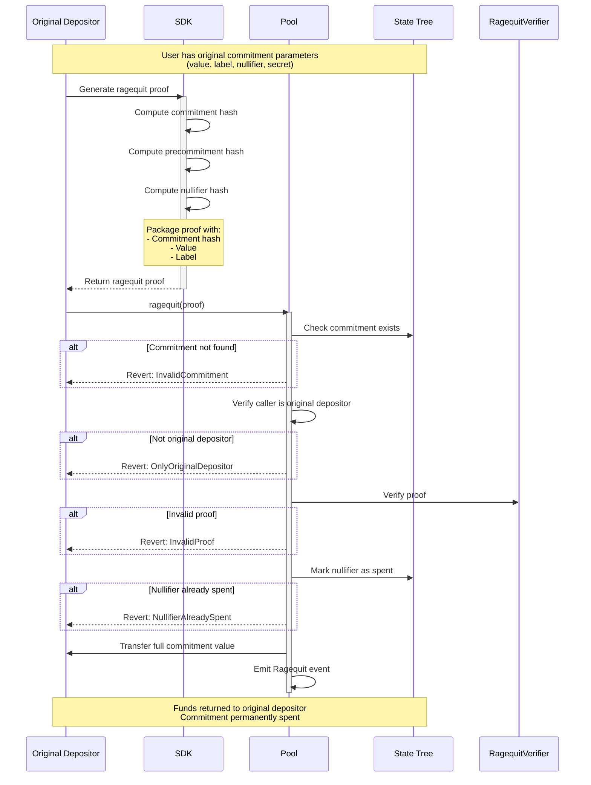

Ragequit allows the original depositor to publicly reclaim their funds at any time, regardless of [ASP](/layers/asp) approval status. The contract enforces no ASP-related checks — only that the caller is the original depositor, the commitment exists, and the nullifier has not been spent. While always available, ragequit is primarily useful when a deposit has not been approved, since approved deposits can use the privacy-preserving [withdrawal](/protocol/withdrawal) path instead.

:::info Integration
For production integration guidance, see [Integrations](/protocol/integrations).
:::

## Protocol Flow

### Ragequit steps

1. Check Requirements
   - Must be original depositor
   - Commitment must not be already spent
2. Generate Proof
3. Call the `ragequit` method with the proof
4. Finalized ragequit
   - User received the full commitment amount
