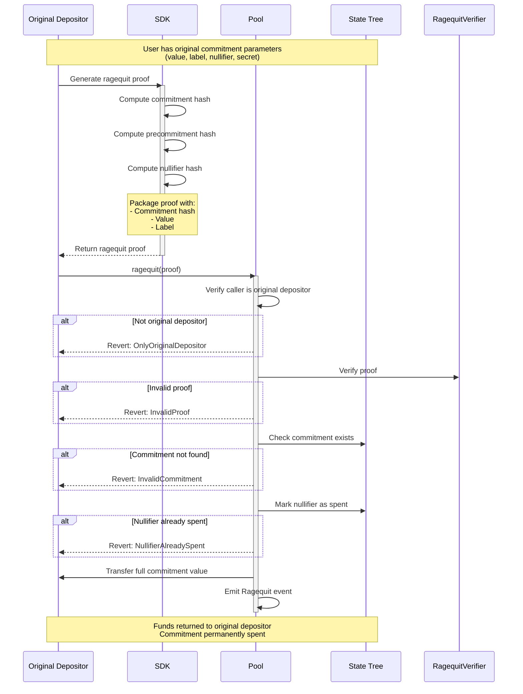

Ragequit allows the original depositor to publicly reclaim their funds at any time, regardless of [ASP](/layers/asp) approval status. The contract enforces no ASP-related checks, only that the caller is the original depositor, the commitment exists, and the nullifier has not been spent. It is the protocol's public exit path. Use the privacy-preserving [withdrawal](/protocol/withdrawal) path when recipient privacy matters.

## Protocol Flow

### Ragequit Steps

1. Check Requirements
   - Must be original depositor (`depositors[label] == msg.sender`)
   - Commitment must not be already spent (nullifier not yet marked)
2. Generate commitment proof via [`sdk.proveCommitment(value, label, nullifier, secret)`](/reference/sdk)
3. Call [`contracts.ragequit(commitmentProof, privacyPoolAddress)`](/reference/sdk)
4. Finalized ragequit
   - User receives the full commitment value
   - Nullifier is marked as spent

## Key Properties

### Unconditional Availability

Ragequit does not require ASP approval. It is the always-available public exit path when:

- A deposit has not yet been approved by the ASP (most deposits are approved within 1 hour, but some may take up to 7 days)
- A label has been retroactively removed from the ASP approved set
- The user explicitly wants a public return to the original depositor address
- The ASP service is unavailable

### Original Depositor Restriction

Only the address that made the original deposit can ragequit. The contract reverts with `OnlyOriginalDepositor` otherwise.

### Mutual Exclusivity with Private Withdrawal

Ragequit and private withdrawal are **mutually exclusive** on the same commitment. Both operations spend the commitment's nullifier. Once a commitment has been exited via either path, the nullifier is marked as spent and the other path will revert with `NullifierAlreadySpent`.

:::info Change commitments after partial withdrawal
A partial private withdrawal creates a new change commitment with a new nullifier. The original commitment's nullifier is spent, but the change commitment can still be ragequit (by the original depositor) or privately withdrawn.
:::

## Next steps

| Goal | Page |
|------|------|
| Compare withdrawal vs ragequit | [Protocol Overview](/protocol#choosing-between-withdrawal-and-ragequit) |
| Frontend patterns for ragequit UX | [UX Patterns](/build/ux-patterns#ragequit-ux) |
| Debug revert reasons | [Errors & Constraints](/reference/errors) |
