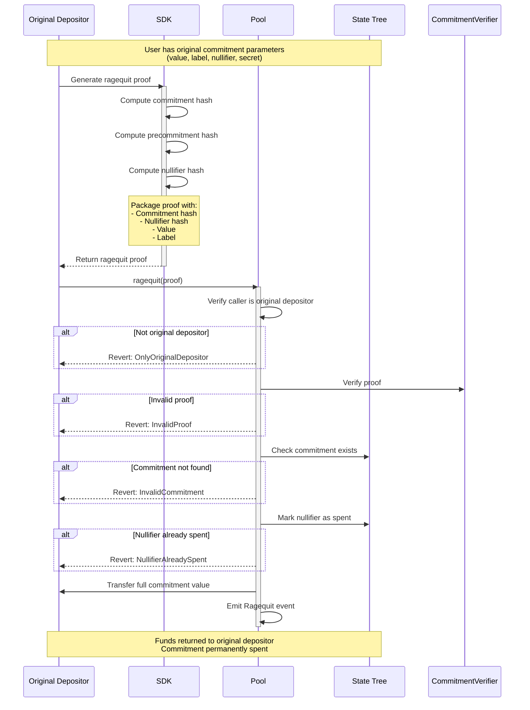

Ragequit allows the original depositor to publicly reclaim the commitment's value without ASP approval. The contract checks that the caller is the original depositor, the commitment exists, and the nullifier has not been spent. When recipient privacy matters, use the [private withdrawal](/protocol/withdrawal) path instead.

## Protocol Flow

### Ragequit Steps

1. Check Requirements
   - Must be original depositor (`depositors[label] == msg.sender`)
   - Commitment must not be already spent (nullifier not yet marked)
2. Generate commitment proof via [`sdk.proveCommitment(value, label, nullifier, secret)`](/reference/sdk)
3. Call [`contracts.ragequit(commitmentProof, privacyPoolAddress)`](/reference/sdk)
4. Finalized ragequit
   - User receives the commitment's value (for a change commitment from a partial withdrawal, this is the remaining balance, not the original deposit amount)
   - Nullifier is marked as spent

## Key Properties

### No ASP Approval Required

Ragequit does not require ASP approval. It is available to the original depositor as long as the commitment has not already been spent:

- A deposit is rejected by the ASP
- A label has been retroactively removed from the ASP approved set
- The user explicitly wants a public return to the original depositor address
- The ASP service is unavailable

Keep ragequit available at all times, but present it as an explicit public exit choice — not the default action during normal ASP review time.

### Original Depositor Restriction

Only the address that made the original deposit can ragequit. The contract reverts with `OnlyOriginalDepositor` otherwise.

### Mutual Exclusivity with Private Withdrawal

Ragequit and private withdrawal are **mutually exclusive** on the same commitment. Both mark the nullifier as spent. Once a commitment has been exited either way, the other path reverts with `NullifierAlreadySpent`.

:::info Change commitments after partial withdrawal
A partial private withdrawal creates a new change commitment with a new nullifier. The original commitment's nullifier is spent, but the change commitment can still be ragequit (by the original depositor) or privately withdrawn.
:::

## Next steps

| Goal | Page |
|------|------|
| Compare withdrawal vs ragequit | [Protocol Overview](/protocol#choosing-between-withdrawal-and-ragequit) |
| Frontend patterns for ragequit UX | [UX Patterns](/build/ux-patterns#ragequit-ux) |
| Debug revert reasons | [Errors & Constraints](/reference/errors) |
