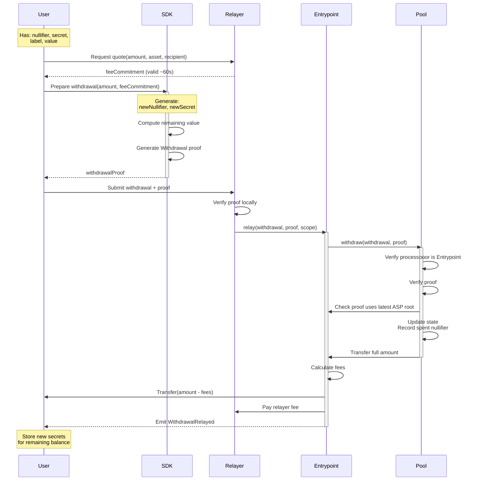

A withdrawal moves funds out of the pool to any recipient address. A zero-knowledge proof demonstrates ownership of a valid, ASP-approved commitment without revealing which one. A relayer submits the transaction so the recipient has no on-chain link to the depositor.

---

Frontend integrations should use relayed withdrawal. A relayer submits `Entrypoint.relay()` for the user, which preserves recipient privacy and matches the production app flow.

**Happy path at a glance:**

1. Verify ASP roots have converged on-chain (`mtRoot === onchainMtRoot`)
2. Request a relayer quote (valid ~60 seconds)
3. Build `Withdrawal` struct using the quote's `feeCommitment.withdrawalData`
4. Generate ZK proof with Merkle proofs from both state and ASP trees
5. Submit proof to relayer before the quote expires

Withdrawal proofs carry two separate roots. The state-tree root comes from the pool's `currentRoot()`, while the ASP root must match `Entrypoint.latestRoot()` and is sourced from ASP `onchainMtRoot`.

## Recommended Frontend Flow



## Withdrawal Data Structure

```solidity
struct Withdrawal {
    address processooor;    // Relayed: Entrypoint address, Direct: tx signer (msg.sender)
    bytes data;             // Relayed: ABI-encoded RelayData, Direct: empty
}

struct RelayData {
    address recipient;     // Final recipient of withdrawn funds
    address feeRecipient;  // Fee receiver from the relayer's signed quote
    uint256 relayFeeBPS;   // Fee in basis points
}
```

:::note
The three-o spelling of `processooor` is intentional — it matches the field name in the deployed smart contracts.
:::

## Withdrawal Steps

### Relayed Withdrawal

1. **User Steps**
   - Construct withdrawal with Entrypoint as processooor
   - Resolve the final recipient and request the relayer quote late in the flow so proof generation and relay submission fit inside the quote TTL
   - Set `withdrawal.data` to the quote's `feeCommitment.withdrawalData` — the proof's `context` depends on the finalized `withdrawal`, so this must happen before proof generation
   - Validate the relayer minimum and warn if the remaining balance after a partial withdrawal would fall below it
   - Generate ZK proof
   - Submit to relayer before the quote expires

:::warning Relayer returns HTTP 200 for failed withdrawals
The relayer returns HTTP 200 for both success and application-level failures. Always check `result.success` before treating the withdrawal as complete. See [Relayer API — Handling Failures](/reference/relayer-api#handling-failures) for the full failure matrix.
:::
2. **Relayer Steps**
   - Verify proof locally
   - Submit transaction to Entrypoint
   - Pay gas fees
3. **Entrypoint Processing**
   - Verify proof and context
   - Process withdrawal through pool
   - Handle fee distribution
   - Transfer assets to recipient

### Quote Lifecycle

The relayer's `feeCommitment` expires approximately **60 seconds** after the quote response. The entire flow (get quote, generate proof, submit relay request) must complete within this window.

Request the quote late in the flow (on the review step), and discard it whenever any of the following change:

- Withdrawal amount
- Recipient address
- Relayer selection
- `extraGas` toggle (optional gas-token drop for non-native assets)
- Quote expiration

After re-quoting, require the user to review and confirm again before proof generation. See [Relayer API Reference](/reference/relayer-api) for endpoint details.

### State Root vs ASP Root

Withdrawal proofs must demonstrate inclusion in two separate Merkle trees, each with its own root source and validation rule:

| | State Root | ASP Root |
|---|-----------|----------|
| **Read from** | Pool `currentRoot()` | ASP API `onchainMtRoot` from `GET /{chainId}/public/mt-roots` |
| **On-chain validation** | Must be one of the last 64 known roots (circular buffer) | Must exactly equal `Entrypoint.latestRoot()` |
| **Tree contents** | Commitment hashes | Approved labels |
| **Error on mismatch** | `UnknownStateRoot` | `IncorrectASPRoot` |

:::warning ASP root convergence required
Always verify ASP root parity before submitting: `BigInt(onchainMtRoot) === Entrypoint.latestRoot()`.

The ASP API returns two root values. `mtRoot` is the ASP's latest computed root; `onchainMtRoot` is the root currently committed on-chain. The `mt-leaves` endpoint returns leaves for `mtRoot`, but proofs must use `onchainMtRoot`. If `mtRoot !== onchainMtRoot`, the ASP has computed a new tree that has not been pushed on-chain yet — wait and re-fetch until they converge before building a proof.
:::

### Change Commitment Refresh

After a withdrawal, a new change commitment is always inserted into the state tree (zero-value for full withdrawals, reduced-value for partial). Before generating the next withdrawal proof from the same pool account:

1. Re-fetch state tree leaves from the [ASP API](/reference/asp-api) or reconstruct via [`DataService`](/reference/sdk)
2. Rebuild the Merkle proof with the updated leaf set
3. Verify the reconstructed root matches the pool's `currentRoot()`

Persist zero-value change commitments for account-history reconstruction, but do not surface them as spendable balances.

:::warning Stale leaves produce invalid proofs
Using stale leaves after a withdrawal will produce an invalid state root. Always re-fetch leaves and rebuild Merkle proofs before generating a new withdrawal proof from the same pool account.
:::

### Context Generation

The `context` signal binds the proof to specific withdrawal parameters:

```solidity
context = uint256(keccak256(abi.encode(
    withdrawal,
    pool.SCOPE()
))) % SNARK_SCALAR_FIELD;
```

<details>
<summary>Contract-Level Direct Withdrawal (advanced)</summary>

`PrivacyPool.withdraw()` still exists at the contract layer, but it is not the recommended frontend path:

- `withdrawal.processooor` must equal `msg.sender`
- the pool pays the signer directly
- recipient privacy is lost compared with the relayed flow

Keep it documented for protocol completeness and error handling, not as a user-facing UX option.

</details>
