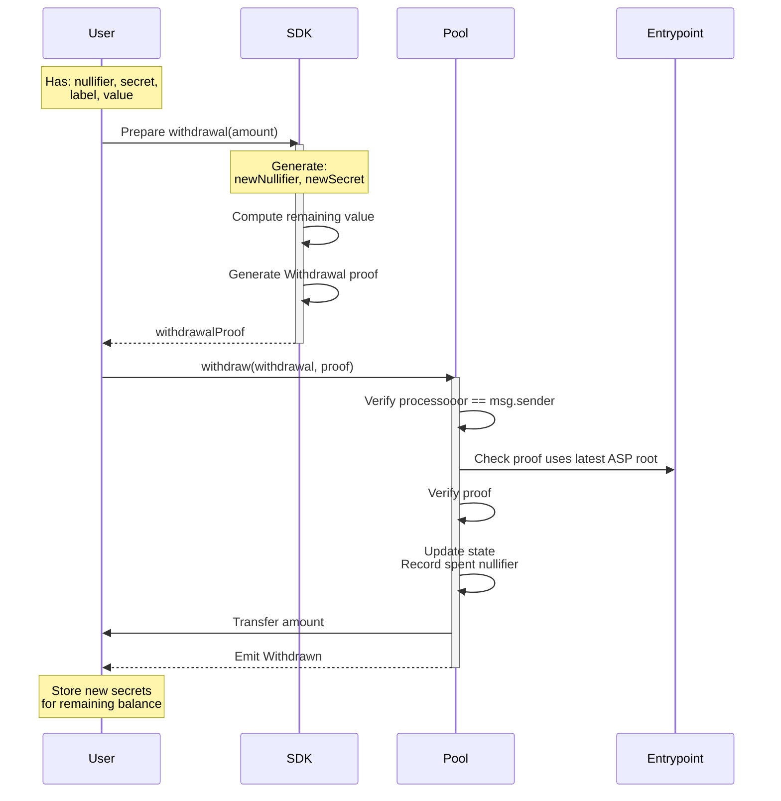
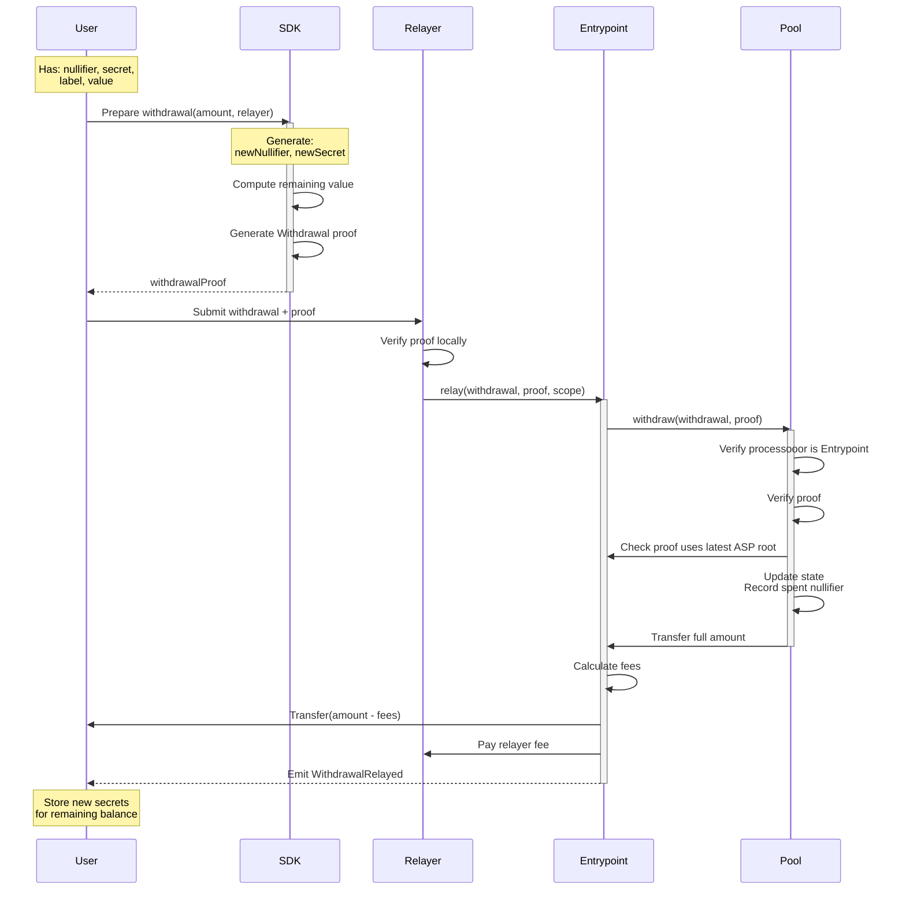

Privacy Pools supports two withdrawal paths, but frontend integrations should build their normal withdrawal UX around the relayed flow:

1. **Relayed Withdrawal**: A relayer submits `Entrypoint.relay()` for the user. This is the privacy-preserving frontend path.
2. **Direct Withdrawal**: The user submits `PrivacyPool.withdraw()` directly. This is an advanced non-private signer-only path.

Both paths require [zero-knowledge proofs](/layers/zk/withdrawal) to prove commitment ownership. Frontend integrations should treat relayed withdrawal as the standard app flow.

:::info Integration
For production integration guidance, see [Frontend Integration](/build/integration).
:::

Withdrawal proofs carry two separate roots. The state-tree root comes from the pool's `currentRoot()` (via SDK `contracts.getStateRoot(poolAddress)`), while the ASP root must match `Entrypoint.latestRoot()` and is sourced from ASP `onchainMtRoot`.

## Withdrawal Types Comparison

| Aspect | Direct Withdrawal | Relayed Withdrawal |
| --- | --- | --- |
| Contract Call | `PrivacyPool.withdraw()` | `Entrypoint.relay()` |
| Who receives pool payout | `processooor` (the signer) | Entrypoint |
| Recipient Rules | `processooor` must equal `msg.sender`, so funds go to the signer | Final recipient comes from `RelayData`; Entrypoint routes funds after pool withdrawal |
| Privacy Outcome | Non-private | Privacy-preserving frontend path |
| Frontend Use | Not a normal app flow | Standard app withdrawal flow |

### Protocol Flow - Direct Withdrawal (Advanced)



### Protocol Flow - Relayed Withdrawal (Recommended production default)



### Withdrawal Data Structure

```solidity
struct Withdrawal {
    address processooor;    // Direct: tx signer (msg.sender), Relayed: Entrypoint address
    bytes data;             // Direct: empty, Relayed: ABI-encoded RelayData
}

struct RelayData {
    address recipient;     // Final recipient of withdrawn funds
    address feeRecipient;  // Fee receiver from the relayer's signed quote
    uint256 relayFeeBPS;   // Fee in basis points
}
```

## Withdrawal Steps

### Direct Withdrawal (Advanced)

1. **Proof Generation**
   - User constructs withdrawal parameters
   - Generates ZK proof of commitment ownership
   - Computes new commitment for remaining value
2. **Contract Interaction**
   - User submits proof to pool contract
   - Pool verifies proof and context
   - Updates state (nullifiers, commitments)
   - Transfers assets to signer (processooor)

Do not expose this as the default frontend action if recipient privacy matters.

### Relayed Withdrawal (Recommended)

1. **User Steps**
   - Construct withdrawal with Entrypoint as processooor
   - Resolve the final recipient and request the relayer quote late in the flow so proof generation and relay submission fit inside the quote TTL
   - Validate the relayer minimum and warn if the remaining balance after a partial withdrawal would fall below it
   - Generate ZK proof
   - Submit to relayer off-chain
2. **Relayer Steps**
   - Verify proof locally
   - Submit transaction to Entrypoint
   - Pay gas fees
3. **Entrypoint Processing**
   - Verify proof and context
   - Process withdrawal through pool
   - Handle fee distribution
   - Transfer assets to recipient

### Quote Lifecycle

The relayer's `feeCommitment` expires approximately **60 seconds** after the quote response. The entire flow -- get quote, generate proof, submit relay request -- must complete within this window.

Request the quote late in the flow (on the review step), and discard it whenever any of the following change:

- Withdrawal amount
- Recipient address
- Relayer selection
- `extraGas` toggle (optional gas-token drop for non-native assets)
- Quote expiration

After re-quoting, require the user to review and confirm again before proof generation. See [Relayer API Reference](/reference/relayer-api) for endpoint details.

### State Root vs ASP Root

Withdrawal proofs carry two separate Merkle roots with different sources and validation rules:

| | State Root | ASP Root |
|---|-----------|----------|
| **Read from** | `contracts.getStateRoot(poolAddress)` (pool `currentRoot()`) | ASP API `onchainMtRoot` from `GET /{chainId}/public/mt-roots` |
| **On-chain validation** | Must be one of the last 64 known roots (circular buffer) | Must exactly equal `Entrypoint.latestRoot()` |
| **Tree contents** | Commitment hashes | Approved labels |
| **Error on mismatch** | `UnknownStateRoot` | `IncorrectASPRoot` |

Always verify ASP root parity before submitting: `BigInt(onchainMtRoot) === Entrypoint.latestRoot()`. See the [ASP API Reference](/reference/asp-api) for details on root convergence.

### Change Commitment Refresh

After a withdrawal, a new zero-value or reduced-value change commitment may be inserted into the state tree. Before generating the next withdrawal proof from the same pool account:

1. Re-fetch state tree leaves from the [ASP API](/reference/asp-api) or reconstruct via `DataService`
2. Rebuild the Merkle proof with the updated leaf set
3. Verify the reconstructed root matches the pool's `currentRoot()`

Persist zero-value change commitments for account-history reconstruction, but do not surface them as spendable balances. Using stale leaves after a withdrawal will produce an invalid state root.

### Context Generation

The `context` signal binds the proof to specific withdrawal parameters:

```solidity
context = uint256(keccak256(abi.encode(
    withdrawal,
    pool.SCOPE()
))) % SNARK_SCALAR_FIELD;
```
