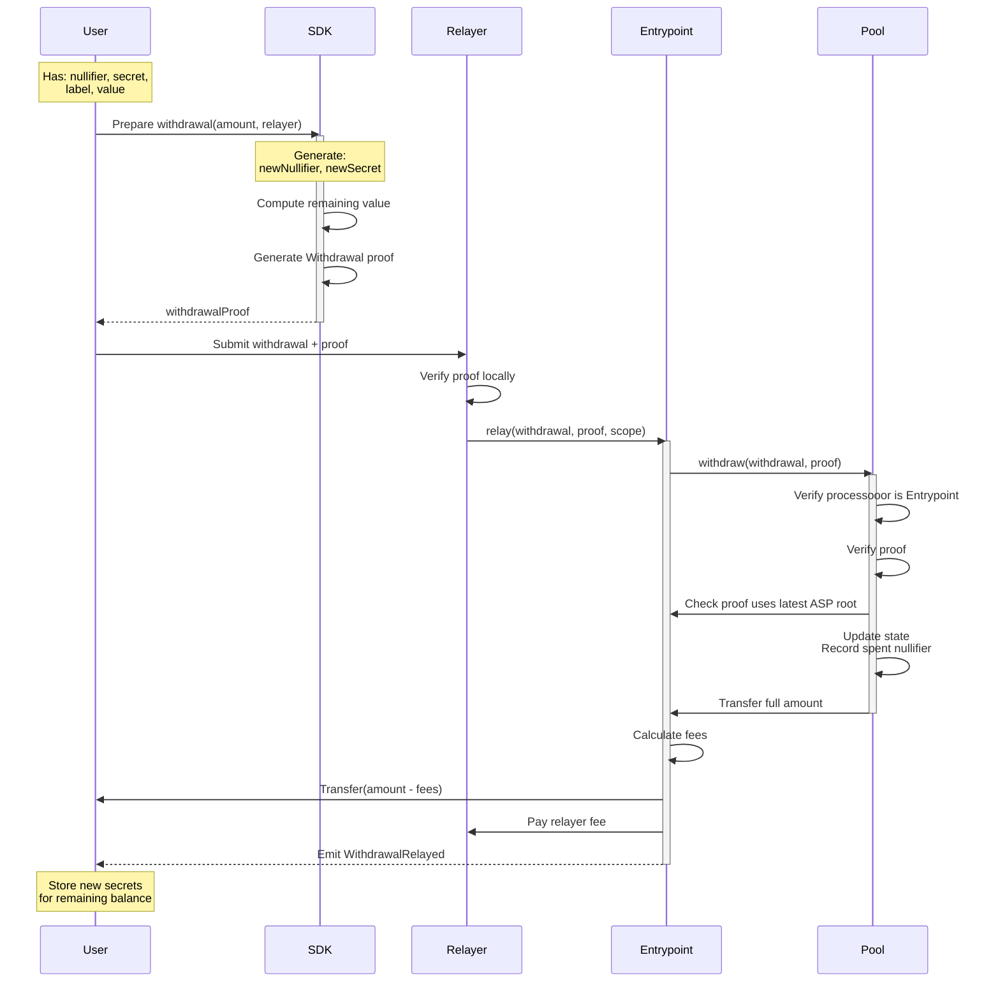

Frontend integrations should use relayed withdrawal. A relayer submits `Entrypoint.relay()` for the user, which preserves recipient privacy and matches the production app flow.

The pool contract also exposes direct `PrivacyPool.withdraw()`, but that is a non-private contract-level path. Keep it out of normal frontend UX.

Withdrawal proofs carry two separate roots. The state-tree root comes from the pool's `currentRoot()`, while the ASP root must match `Entrypoint.latestRoot()` and is sourced from ASP `onchainMtRoot`.

## Recommended Frontend Flow



## Contract-Level Direct Withdrawal

`PrivacyPool.withdraw()` still exists at the contract layer, but it is not the recommended frontend path:

- `withdrawal.processooor` must equal `msg.sender`
- the pool pays the signer directly
- recipient privacy is lost compared with the relayed flow

Keep it documented for protocol completeness and error handling, not as a user-facing UX option.

## Withdrawal Data Structure

```solidity
struct Withdrawal {
    address processooor;    // Relayed: Entrypoint address, Direct: tx signer (msg.sender)
    bytes data;             // Relayed: ABI-encoded RelayData, Direct: empty
}

struct RelayData {
    address recipient;     // Final recipient of withdrawn funds
    address feeRecipient;  // Fee receiver from the relayer's signed quote
    uint256 relayFeeBPS;   // Fee in basis points
}
```

## Withdrawal Steps

### Relayed Withdrawal

1. **User Steps**
   - Construct withdrawal with Entrypoint as processooor
   - Resolve the final recipient and request the relayer quote late in the flow so proof generation and relay submission fit inside the quote TTL
   - Validate the relayer minimum and warn if the remaining balance after a partial withdrawal would fall below it
   - Generate ZK proof
   - Submit to relayer off-chain
2. **Relayer Steps**
   - Verify proof locally
   - Submit transaction to Entrypoint
   - Pay gas fees
3. **Entrypoint Processing**
   - Verify proof and context
   - Process withdrawal through pool
   - Handle fee distribution
   - Transfer assets to recipient

### Quote Lifecycle

The relayer's `feeCommitment` expires approximately **60 seconds** after the quote response. The entire flow -- get quote, generate proof, submit relay request -- must complete within this window.

Request the quote late in the flow (on the review step), and discard it whenever any of the following change:

- Withdrawal amount
- Recipient address
- Relayer selection
- `extraGas` toggle (optional gas-token drop for non-native assets)
- Quote expiration

After re-quoting, require the user to review and confirm again before proof generation. See [Relayer API Reference](/reference/relayer-api) for endpoint details.

### State Root vs ASP Root

Withdrawal proofs carry two separate Merkle roots with different sources and validation rules:

| | State Root | ASP Root |
|---|-----------|----------|
| **Read from** | Pool `currentRoot()` | ASP API `onchainMtRoot` from `GET /{chainId}/public/mt-roots` |
| **On-chain validation** | Must be one of the last 64 known roots (circular buffer) | Must exactly equal `Entrypoint.latestRoot()` |
| **Tree contents** | Commitment hashes | Approved labels |
| **Error on mismatch** | `UnknownStateRoot` | `IncorrectASPRoot` |

Always verify ASP root parity before submitting: `BigInt(onchainMtRoot) === Entrypoint.latestRoot()`. See the [ASP API Reference](/reference/asp-api) for details on root convergence.

### Change Commitment Refresh

After a withdrawal, a new zero-value or reduced-value change commitment may be inserted into the state tree. Before generating the next withdrawal proof from the same pool account:

1. Re-fetch state tree leaves from the [ASP API](/reference/asp-api) or reconstruct via `DataService`
2. Rebuild the Merkle proof with the updated leaf set
3. Verify the reconstructed root matches the pool's `currentRoot()`

Persist zero-value change commitments for account-history reconstruction, but do not surface them as spendable balances. Using stale leaves after a withdrawal will produce an invalid state root.

### Context Generation

The `context` signal binds the proof to specific withdrawal parameters:

```solidity
context = uint256(keccak256(abi.encode(
    withdrawal,
    pool.SCOPE()
))) % SNARK_SCALAR_FIELD;
```
