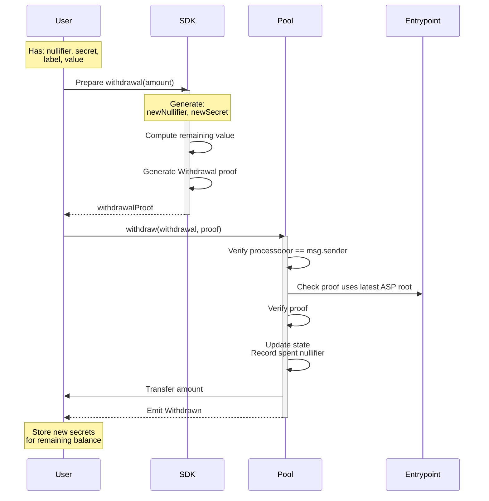
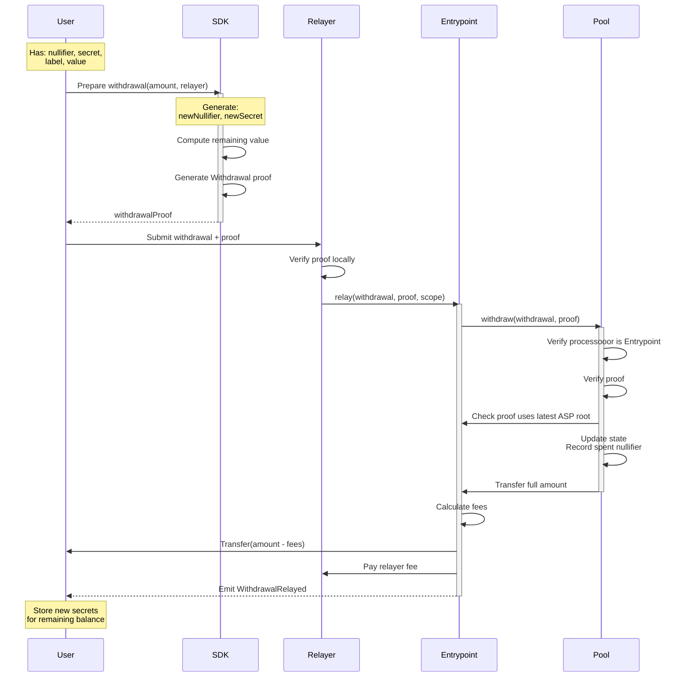

Privacy Pools supports two types of withdrawals:

1. **Direct Withdrawals**: User directly interacts with pool contract
2. **Relayed Withdrawals**: Withdrawal processed through a relayer for additional privacy

Both methods require [zero-knowledge proofs](/layers/zk/withdrawal) to prove commitment ownership and maintain privacy.

:::info Integration
For production workflow guidance, see [Integrations](/protocol/integrations) and [skills.md](https://docs.privacypools.com/skills.md).
:::

Integration note: withdrawal proofs carry two separate roots. The state-tree root comes from the pool's `currentRoot()` (via SDK `contracts.getStateRoot(poolAddress)`), while the ASP root must match `Entrypoint.latestRoot()` and is sourced from ASP `onchainMtRoot`.

## Withdrawal Types Comparison

| Aspect                   | Direct Withdrawal  | Relayed Withdrawal                      |
| ------------------------ | ------------------ | --------------------------------------- |
| Privacy Level            | Basic (signer pays gas, linking address to on-chain activity) | Enhanced (relayer pays gas, decoupling recipient from tx sender) |
| Gas Payment              | User pays directly | Relayer pays, takes fee                 |
| Fee Structure            | No fees            | Configurable relayer fee                |
| Complexity               | Simpler flow       | Additional fee computation              |
| Front-running Protection | Context-based      | Context-based                           |

### Protocol Flow - Direct Withdrawal



### Protocol Flow - Relayed Withdrawal



### Withdrawal Data Structure

```solidity
struct Withdrawal {
    address processooor;    // Direct: tx signer (msg.sender), Relayed: Entrypoint address
    bytes data;             // Direct: empty, Relayed: ABI-encoded RelayData
}

struct RelayData {
    address recipient;     // Final recipient of withdrawn funds
    address feeRecipient;  // Relayer address (receives the fee)
    uint256 relayFeeBPS;   // Fee in basis points
}
```

## Withdrawal Steps

### Direct Withdrawal

1. **Proof Generation**
   - User constructs withdrawal parameters
   - Generates ZK proof of commitment ownership
   - Computes new commitment for remaining value
2. **Contract Interaction**
   - User submits proof to pool contract
   - Pool verifies proof and context
   - Updates state (nullifiers, commitments)
   - Transfers assets to signer (processooor)

### Relayed Withdrawal

1. **User Steps**
   - Construct withdrawal with Entrypoint as processooor
   - Generate ZK proof
   - Submit to relayer off-chain
2. **Relayer Steps**
   - Verify proof locally
   - Submit transaction to Entrypoint
   - Pay gas fees
3. **Entrypoint Processing**
   - Verify proof and context
   - Process withdrawal through pool
   - Handle fee distribution
   - Transfer assets to recipient

### Context Generation

The `context` signal binds the proof to specific withdrawal parameters:

```solidity
context = uint256(keccak256(abi.encode(
    withdrawal,
    pool.SCOPE()
))) % SNARK_SCALAR_FIELD;
```
