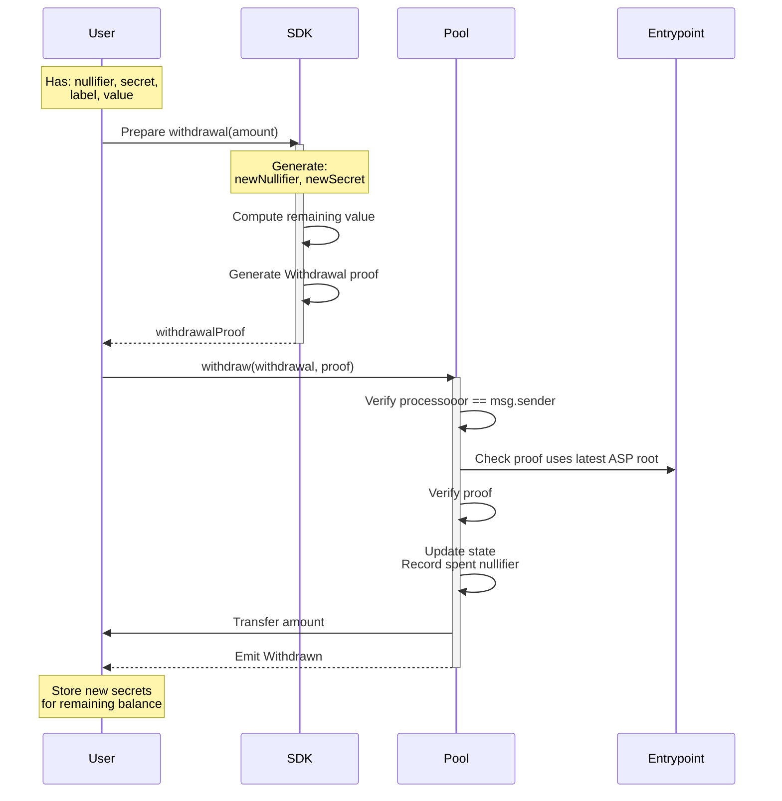
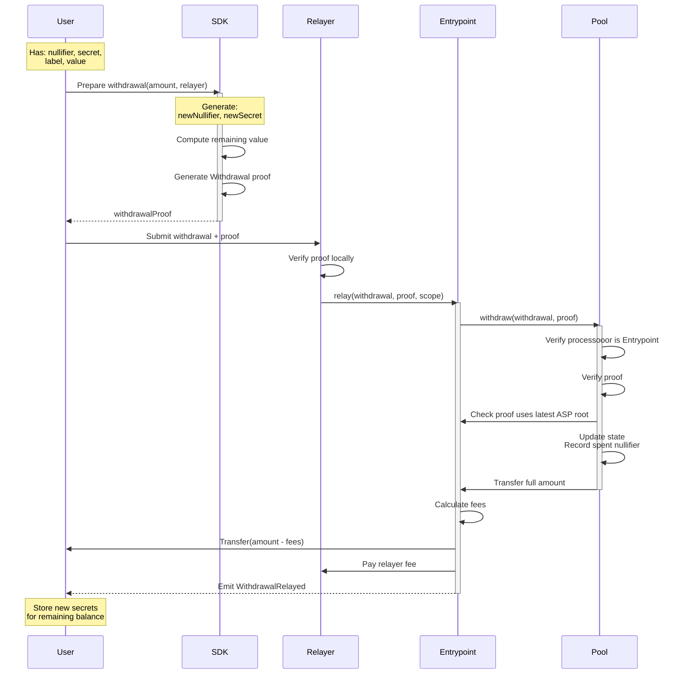

Privacy Pools supports two withdrawal paths, but recommended production frontends should expose the relayed flow as the primary private-withdraw action:

1. **Relayed Withdrawal**: A relayer submits `Entrypoint.relay()` for the user. This is the privacy-preserving frontend path.
2. **Direct Withdrawal**: The user submits `PrivacyPool.withdraw()` directly. This is an advanced non-private signer-only path.

Both paths require [zero-knowledge proofs](/layers/zk/withdrawal) to prove commitment ownership. Recommended frontends should use the relayed path when recipient privacy matters.

:::info Integration
For production workflow guidance, see [Integrations](/protocol/integrations) and [skills.md](https://docs.privacypools.com/skills.md).
:::

Integration note: withdrawal proofs carry two separate roots. The state-tree root comes from the pool's `currentRoot()` (via SDK `contracts.getStateRoot(poolAddress)`), while the ASP root must match `Entrypoint.latestRoot()` and is sourced from ASP `onchainMtRoot`.

## Production Frontend Pattern

- Only offer private withdrawal from pool accounts with `balance > 0` and ASP approval.
- Resolve ENS on mainnet, or resolve any other human-readable recipient input to a final address, before requesting a quote or generating a proof.
- Fetch `GET /relayer/details` and warn if a partial withdrawal would leave a non-zero remainder below `minWithdrawAmount`.
- Request the quote on the review step, keep a visible countdown, and if amount, recipient, relayer, or `extraGas` changes, refresh the quote and require another confirm click.
- Treat `extraGas` as an optional gas-token drop for supported non-native assets and reflect it in fee display plus quote invalidation.
- If proof generation takes noticeable time, surface progress states such as circuit loading, proof generation, and proof verification.
- Treat direct withdrawal as an advanced non-private option. If the frontend wants private withdrawal, it should use the relayed path.
- Keep ragequit separate as the explicit public fallback.

## Withdrawal Types Comparison

| Aspect | Direct Withdrawal | Relayed Withdrawal |
| --- | --- | --- |
| Contract Call | `PrivacyPool.withdraw()` | `Entrypoint.relay()` |
| Who receives pool payout | `processooor` (the signer) | Entrypoint |
| Recipient Rules | `processooor` must equal `msg.sender`, so funds go to the signer | Final recipient comes from `RelayData`; Entrypoint routes funds after pool withdrawal |
| Privacy Outcome | Non-private | Privacy-preserving frontend path |
| Frontend Guidance | Advanced only | Recommended default |

### Protocol Flow - Direct Withdrawal (Advanced)



### Protocol Flow - Relayed Withdrawal (Recommended production default)



### Withdrawal Data Structure

```solidity
struct Withdrawal {
    address processooor;    // Direct: tx signer (msg.sender), Relayed: Entrypoint address
    bytes data;             // Direct: empty, Relayed: ABI-encoded RelayData
}

struct RelayData {
    address recipient;     // Final recipient of withdrawn funds
    address feeRecipient;  // Relayer address (receives the fee)
    uint256 relayFeeBPS;   // Fee in basis points
}
```

## Withdrawal Steps

### Direct Withdrawal (Advanced)

1. **Proof Generation**
   - User constructs withdrawal parameters
   - Generates ZK proof of commitment ownership
   - Computes new commitment for remaining value
2. **Contract Interaction**
   - User submits proof to pool contract
   - Pool verifies proof and context
   - Updates state (nullifiers, commitments)
   - Transfers assets to signer (processooor)

Do not expose this as the default frontend action if recipient privacy matters.

### Relayed Withdrawal (Recommended)

1. **User Steps**
   - Construct withdrawal with Entrypoint as processooor
   - Resolve the final recipient and request the relayer quote late in the flow so proof generation and relay submission fit inside the quote TTL
   - Validate the relayer minimum and warn if the remaining balance after a partial withdrawal would fall below it
   - Generate ZK proof
   - Submit to relayer off-chain
2. **Relayer Steps**
   - Verify proof locally
   - Submit transaction to Entrypoint
   - Pay gas fees
3. **Entrypoint Processing**
   - Verify proof and context
   - Process withdrawal through pool
   - Handle fee distribution
   - Transfer assets to recipient

### Context Generation

The `context` signal binds the proof to specific withdrawal parameters:

```solidity
context = uint256(keccak256(abi.encode(
    withdrawal,
    pool.SCOPE()
))) % SNARK_SCALAR_FIELD;
```
