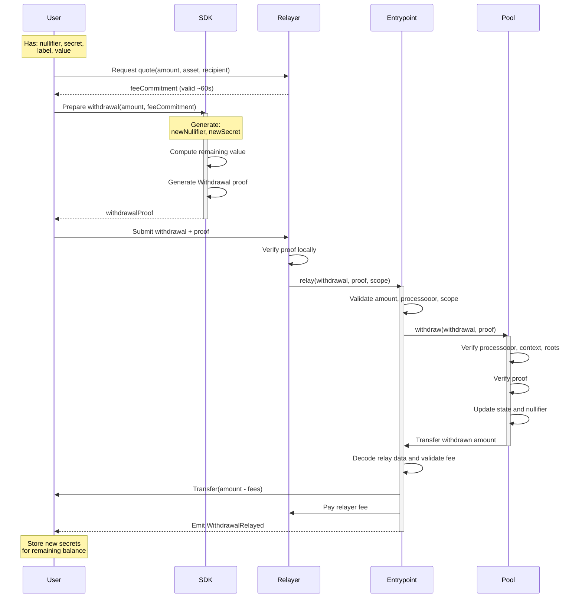
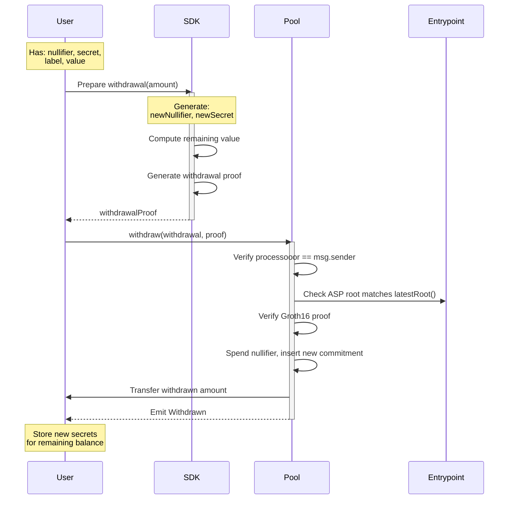

A withdrawal moves funds out of the pool to any recipient address. A zero-knowledge proof demonstrates ownership of a valid, ASP-approved commitment without revealing which one. Frontend integrations should use relayed withdrawal: a relayer submits `Entrypoint.relay()` for the user, preserving recipient privacy.

## Recommended Frontend Flow


```mermaid
sequenceDiagram
    participant User
    participant SDK
    participant Relayer
    participant Entrypoint
    participant Pool


    Note over User: Has: nullifier, secret,<br/>label, value

    User->>Relayer: Request quote(amount, asset, recipient)
    Relayer-->>User: feeCommitment (valid ~60s)

    User->>SDK: Prepare withdrawal(amount, feeCommitment)

    activate SDK
    Note over SDK: Generate:<br/>newNullifier, newSecret
    SDK->>SDK: Compute remaining value
    SDK->>SDK: Generate Withdrawal proof
    SDK-->>User: withdrawalProof
    deactivate SDK

    User->>Relayer: Submit withdrawal + proof
    Relayer->>Relayer: Verify proof locally
    Relayer->>Entrypoint: relay(withdrawal, proof, scope)

    activate Entrypoint
    Entrypoint->>Entrypoint: Validate amount, processooor, scope
    Entrypoint->>Pool: withdraw(withdrawal, proof)

    activate Pool
    Pool->>Pool: Verify processooor, context, roots
    Pool->>Pool: Verify proof
    Pool->>Pool: Update state and nullifier
    Pool->>Entrypoint: Transfer withdrawn amount
    deactivate Pool

    Entrypoint->>Entrypoint: Decode relay data and validate fee
    Entrypoint->>User: Transfer(amount - fees)
    Entrypoint->>Relayer: Pay relayer fee

    Entrypoint-->>User: Emit WithdrawalRelayed
    deactivate Entrypoint

    Note over User: Store new secrets<br/>for remaining balance

```

## Withdrawal Data Structure

```solidity
struct Withdrawal {
    address processooor;    // Relayed: Entrypoint address, Direct: tx signer (msg.sender)
    bytes data;             // Relayed: ABI-encoded RelayData, Direct: empty
}

struct RelayData {
    address recipient;     // Final recipient of withdrawn funds
    address feeRecipient;  // Fee receiver from the relayer's signed quote
    uint256 relayFeeBPS;   // Fee in basis points
}
```

:::note
The three-o spelling of `processooor` is intentional and matches the field name in the deployed smart contracts.
:::

## Withdrawal Steps

:::tip Quick reference
1. Verify ASP root convergence (`mtRoot === onchainMtRoot`)
2. Request relayer quote (~60s TTL)
3. ABI-encode `withdrawal.data` client-side
4. Generate ZK proof with state + ASP Merkle proofs
5. Submit to relayer before quote expires
:::

### Relayed Withdrawal

1. **User Steps**
   - Construct withdrawal with Entrypoint as processooor
   - Resolve the final recipient before requesting the quote. Request the quote late in the flow so that proof generation and relay submission fit within the TTL.
   - ABI-encode `withdrawal.data` client-side (see [Relayer API: withdrawal.data construction](/reference/relayer-api#post-relayerquote) for the canonical encoding rule). This must happen before proof generation because the proof's `context` depends on the finalized `withdrawal`.
   - Validate the relayer minimum and warn if the remaining balance after a partial withdrawal would fall below it
   - Generate ZK proof
   - Submit to relayer before the quote expires

:::warning Relayer returns HTTP 200 for failed withdrawals
The relayer returns HTTP 200 for both success and application-level failures. Always check `result.success` before treating the withdrawal as complete. See [Relayer API: Handling Failures](/reference/relayer-api#handling-failures) for the full failure matrix.
:::
2. **Relayer Steps**
   - Verify proof locally
   - Submit transaction to Entrypoint
   - Pay gas fees
3. **Entrypoint Processing**
   - Verify withdrawn amount is non-zero
   - Verify `withdrawal.processooor == address(this)` and resolve the pool from `scope`
   - Call `pool.withdraw(...)`
   - Decode `RelayData`, validate the relay fee, and transfer assets to the recipient and fee recipient
4. **Pool Processing**
   - Verify `msg.sender == withdrawal.processooor`
   - Verify `context`, known state root, and latest ASP root
   - Verify the Groth16 proof
   - Spend the nullifier, insert the change commitment, and transfer the withdrawn amount back to the Entrypoint

### Quote Lifecycle

The relayer's `feeCommitment` expires approximately **60 seconds** after the quote response. The entire flow (get quote, generate proof, submit relay request) must complete within this window.

Request the quote late in the flow (on the review step), and discard it whenever any of the following change:

- Withdrawal amount
- Recipient address
- Relayer selection
- `extraGas` toggle (optional gas-token drop for non-native assets)
- Quote expiration

After re-quoting, require the user to review and confirm again before proof generation. See [Relayer API Reference](/reference/relayer-api) for endpoint details.

### State Root vs ASP Root

Withdrawal proofs need Merkle inclusion in two trees, each validated against a different root:

| | State Root | ASP Root |
|---|-----------|----------|
| **Read from** | Pool `currentRoot()` | ASP API `onchainMtRoot` from `GET /{chainId}/public/mt-roots` |
| **On-chain validation** | Must be one of the last 64 known roots (circular buffer) | Must exactly equal `Entrypoint.latestRoot()` |
| **Tree contents** | Commitment hashes | Approved labels |
| **Error on mismatch** | `UnknownStateRoot` | `IncorrectASPRoot` |

:::warning ASP root convergence required
Always verify ASP root parity before submitting: `BigInt(onchainMtRoot) === Entrypoint.latestRoot()`.

The ASP API returns two root values. `mtRoot` is the ASP's latest computed root; `onchainMtRoot` is the root currently committed on-chain. The `mt-leaves` endpoint returns leaves for `mtRoot`, but proofs must use `onchainMtRoot`. If `mtRoot !== onchainMtRoot`, the ASP has computed a new tree that has not been pushed on-chain yet. Wait and re-fetch until they converge before building a proof.
:::

### Change Commitment Refresh

After a withdrawal, a new change commitment is always inserted into the state tree (zero value for full withdrawals, reduced value for partial). Before generating the next withdrawal proof from the same pool account:

1. Re-fetch state tree leaves from the [ASP API](/reference/asp-api) or reconstruct via [`DataService`](/reference/sdk)
2. Rebuild the Merkle proof with the updated leaf set
3. Verify the reconstructed root matches the pool's `currentRoot()`

Persist zero-value change commitments for account-history reconstruction, but do not surface them as spendable balances.

### Context Generation

The `context` signal binds the proof to specific withdrawal parameters:

```solidity
context = uint256(keccak256(abi.encode(
    withdrawal,
    pool.SCOPE()
))) % SNARK_SCALAR_FIELD;
```

### Direct Withdrawal

Direct withdrawal calls `PrivacyPool.withdraw()` without a relayer. The caller interacts with the pool contract directly and receives funds to their own address.

:::warning Relayed withdrawal is strongly preferred
Direct withdrawal reveals the on-chain link between the caller and the withdrawal, eliminating the privacy benefit that relayed withdrawal provides. Use direct withdrawal only when relayer infrastructure is unavailable or when recipient privacy is not a concern (e.g., in testing or contract-to-contract integrations).
:::

| Aspect | Direct | Relayed |
|---|---|---|
| **Privacy** | Caller address visible on-chain | Recipient hidden behind relayer |
| **Gas** | Caller pays directly | Relayer pays, takes fee |
| **Fee** | No relay fee | Configurable relay fee (BPS) |
| **`processooor`** | `msg.sender` (the caller) | Entrypoint address |
| **`withdrawal.data`** | Empty (`0x`) | ABI-encoded `RelayData` |


```mermaid
sequenceDiagram
    participant User
    participant SDK
    participant Pool
    participant Entrypoint

    Note over User: Has: nullifier, secret,<br/>label, value

    User->>SDK: Prepare withdrawal(amount)

    activate SDK
    Note over SDK: Generate:<br/>newNullifier, newSecret
    SDK->>SDK: Compute remaining value
    SDK->>SDK: Generate withdrawal proof
    SDK-->>User: withdrawalProof
    deactivate SDK

    User->>Pool: withdraw(withdrawal, proof)

    activate Pool
    Pool->>Pool: Verify processooor == msg.sender
    Pool->>Entrypoint: Check ASP root matches latestRoot()
    Pool->>Pool: Verify Groth16 proof
    Pool->>Pool: Spend nullifier, insert new commitment
    Pool->>User: Transfer withdrawn amount
    Pool-->>User: Emit Withdrawn
    deactivate Pool

    Note over User: Store new secrets<br/>for remaining balance
```

**Steps:**

1. Build a `Withdrawal` struct with `processooor` set to the caller's address and `data` set to `0x`.
2. Generate the withdrawal proof the same way as for relayed withdrawal (state + ASP Merkle proofs, context, etc.). The `context` is still `uint256(keccak256(abi.encode(withdrawal, scope))) % SNARK_SCALAR_FIELD`, using the direct `Withdrawal` struct.
3. Call `pool.withdraw(withdrawal, proof)` directly on the pool contract.
4. The pool runs the `validWithdrawal` modifier checks (processooor, context, tree depths, state root, ASP root), then verifies the proof and transfers funds to `processooor`.
